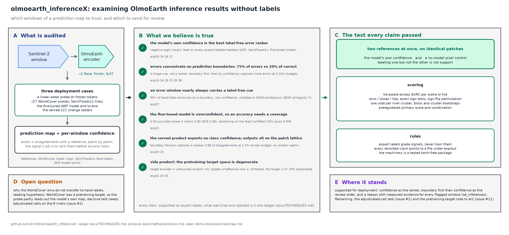

# olmoearth_inferenceX

**Label-free auditing of OlmoEarth inference results: which windows of a
prediction map to trust, which to send for review first, and why.**

OlmoEarth returns a prediction map and nothing else. This repository turns
that map into a review plan a person or an agent can act on, with a reason
attached to every flagged window, and it holds the evidence behind each
rule. Every rule was scored against the model's own confidence and against
a pixel statistic computed with no model at all, on two references at once,
and graded on expert labels only.

## What it delivers

The package [`oe_inferencex/`](oe_inferencex/) is torch-free and covered by
tests that reproduce the recorded numbers from the committed artifacts.

| Module | What it gives you |
|---|---|
| `assess` | Review sets at any budget from a logit, probability or exported-confidence map, in confidence order or in the boundary-first order; error rate, capture at each budget and tie-aware AURC when a reference map exists |
| `explain` | Why each flagged window is suspect: label-free cues, each with its measured share among error and correct windows and the experiment that measured it |
| `signals` | Confidence, the boundary indicator, tiling instability, the NDWI cues and the pixel controls, as pure functions |
| `metrics`, `stats` | Tie-aware AURC and capture at a budget, exact sign tests, one vote per cluster, block and cluster bootstraps |
| `taskcard`, `lcc` | What each fine-tuned OlmoEarth model is; a range reader for the served change rasters |

## Quick start

```python
import numpy as np
from oe_inferencex.assess import assess_prediction, summary
from oe_inferencex.explain import explain_review_set
from oe_inferencex.signals import ndwi_level

logits = np.load("water_logits.npy")        # (H, W) binary logits, or (C, H, W) per class
s2 = np.load("s2_window.npy")               # (12, H, W) Sentinel-2 bands, for the spectral cue

out = assess_prediction(logits, is_logit=True, patch=4, budgets=(0.05, 0.10), order="boundary_first")
why = explain_review_set(out, cues={"ndwi_ambiguous": ndwi_level(s2, patch=4) > -0.1})

summary(out)["review_sets"]["0.05"]         # the 4-px windows to review first, with the boundary share of the set
why["budgets"][0.05]["windows"][0]          # {'row': 28, 'col': 26, 'confidence': 0.48, 'cues': ['boundary', 'low_confidence', 'ndwi_ambiguous']}
why["quotes"]["ndwi_ambiguous"]             # "is spectrally ambiguous ... (48% of error windows vs 7% of correct ones, 7.2x; ...)"
```

`assess_classmap` does the same for a hard class map with an exported
confidence band, the production case. With `reference=`, the assessment
also reports the error rate, the errors captured at each budget and the
tie-aware AURC of confidence. Arrays stay in `out["arrays"]`; `summary`
is the JSON-safe view that crosses a tool boundary
([agent contract](docs/method/agent_integration.md)).

## What holds



1. **The model's own confidence is the best label-free error ranker** on
   every expert-labelled testbed: AWF points, Sen1Floods11 hand labels, and
   the fine-tuned model run end to end (exp04, exp16, exp18, exp21).
2. **Review boundary windows first, then by confidence.** Errors sit on
   prediction boundaries, 75% of errors against 21% of correct windows, and
   this order captures more of them than confidence alone at 5% and 10%
   review budgets on hand labels, preregistered (exp36). No extra inference.
3. **Every flagged window comes with a reason.** 95% of the error windows on
   hand labels carry at least one label-free cue with a measured enrichment;
   spectral ambiguity is 7x enriched and the one cue that adds precision
   inside the review set (exp37).
4. **An accuracy needs a coverage.** The fine-tuned model is 0.93 accurate
   where it claims 0.99; keeping the 80% most confident windows gives 0.945
   (exp21).
5. **The served product can be triaged without confidence.** It exports no
   class confidence; boundary fraction alone captures a median 0.88 of the
   disagreements at a 5% review budget (exp20).

## The numbers

Sen1Floods11 Bolivia hand labels, 81,984 windows, 8.8% of them errors
(exp36, exp37):

| Review budget | Errors caught, confidence order | Errors caught, boundary first | Error rate inside the set |
|---|---|---|---|
| 5% | 0.259 | 0.274 | 0.38 |
| 10% | 0.465 | 0.494 | 0.33 |
| 20% | 0.749 | 0.732 | 0.26 |

Why a window is flagged: share among error windows against correct windows
on the same testbed, with the error rate among windows carrying the cue
(exp37):

| Cue | Errors / correct | Enrichment | Error rate with the cue |
|---|---|---|---|
| on a prediction boundary | 0.750 / 0.214 | 3.5x | 0.25 |
| among the least confident 20% | 0.589 / 0.163 | 3.6x | 0.26 |
| unstable under a tiling shift | 0.583 / 0.164 | 3.6x | 0.26 |
| spectrally ambiguous, NDWI near zero | 0.483 / 0.067 | 7.2x | 0.41 |

## How a claim gets in

A candidate rule or cue is tested on two references at once, the ESA
WorldCover map and hand-labelled flood masks, against the model's own
confidence and four no-model controls. The primary test and its direction
are written down before the run. Scores are tie-aware; scenes vote once
per river; tiles are bootstrapped as clusters. Expert labels grade a rule
and never train it. A win against the weak map alone is not support. Every
number in the documentation points to a file under `exp/out/`, and the
package tests recompute the recorded ones.

## Limits and the open question

The hand-label testbed is one flood event scored with a linear probe, and
the fine-tuned model contributes 41 errors in 344 windows, so the gains
above are real but small and replicated on one region. Tiling instability
wins 26 of 27 scenes and 8 of 8 rivers against the WorldCover map yet not
on hand labels; the decisive test needs adjudicated cells on the eight
rivers ([issue 2](https://github.com/2imi9/olmoearth_inferenceX/issues/2)).
A second expert-labelled few-class testbed with a spatial split is the
next thing that would raise the evidence
([issue 7](https://github.com/2imi9/olmoearth_inferenceX/issues/7)).

Side product: OlmoEarth v1's pretraining target has effective rank 2, and a
normalised target is 57 to 70% predictable from context (exp32 to exp34,
[issue 11](https://github.com/2imi9/olmoearth_inferenceX/issues/11)).

## Reproduce

```bash
uv sync                                 # the package only, no torch
uv run pytest                           # the package against the recorded numbers
uv sync --extra encoder --extra geo     # full experiment environment (Linux resolves the cu128 torch build)
uv run python exp/exp02_full_slice.py   # one scene end to end
```

Experiments are `exp01`–`exp38` in [`exp/`](exp/), outputs under
`exp/out/`, chronology in the [lab log](exp/NOTES.md). What was tried and
rejected is kept as evidence in the [technique ledger](docs/TECHNIQUES.md),
one line each with the reason.

## Documentation

| | |
|---|---|
| [Technique ledger](docs/TECHNIQUES.md) | Everything tried, one line each, with the verdict and the evidence |
| [Recipe](docs/method/recipe.md) · [Protocol](docs/method/protocol.md) | What to do and not do; how results are scored |
| [Explanation](docs/results/explanation.md) · [Signals](docs/results/signals.md) · [Comparisons](docs/results/comparisons.md) | Per-cue, per-signal and per-experiment evidence |
| [Agent integration](docs/method/agent_integration.md) | Contract with the OlmoEarth Agent |
| [Task cards](docs/method/taskcards.md) · [Infrastructure](docs/method/infrastructure.md) | What each model is; upstream sources and formats |
| [Roadmap](docs/plan/roadmap.md) | Open items in priority order |

*Research code under active development; results are updated in place.*
