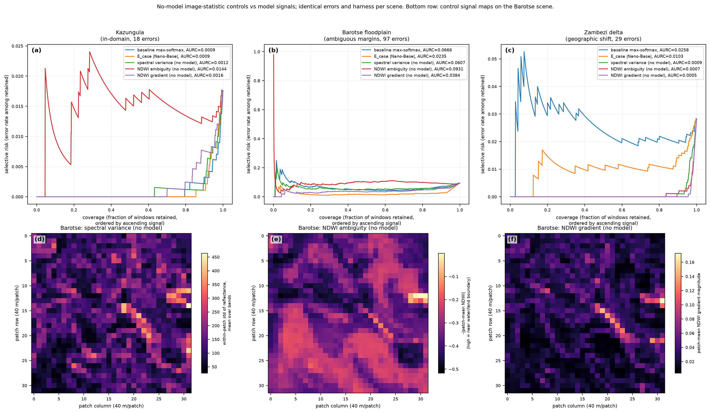

# olmoearth_inferenceX

**A protocol for comparing inference outputs without labels.**

Two things disagree — a model and a reference, two model versions, two
scorers, two explanations for the same discrepancy. Which do you believe,
and is the difference real? Signals are label-free; labels only grade them.

Two applications are demonstrated: **error ranking** (which windows is the
model getting wrong?) and **cross-inference evaluation** (of two runs, which
should you believe?). The signal designs are adapted from LLM
hallucination-detection methods, which face the same no-reference problem.

| Audited | How |
|---|---|
| Linear probes on frozen v1 encoders | Binary water head trained on one WorldCover-labelled scene; nine-class head on the AWF labels |
| [`OlmoEarth-v1-FT-AWF-Base`](https://huggingface.co/allenai/OlmoEarth-v1-FT-AWF-Base) | End to end, on the 344 validation points of the official split (exp21) |
| [`olmoearth_lcc`](https://huggingface.co/datasets/allenai/olmoearth_lcc) rasters | As served: ten 512-px windows, plus periodicity on five 4096-px windows (exp20, exp22) |
| v1 vs v1.2 encoders | Whether RoPE changes the tiling-instability result (exp19) |

## The numbers

Each signal scores every window for how likely it is wrong:

- **E_system**, tiling instability — the prediction flips when the input grid
  shifts a few pixels; behaves like boundary proximity (exp14)
- **E_case**, disagreement — two models, or one model's three Sentinel-2
  band-set tokens, predict the window differently (exp17)
- **E_dist**, embedding distance — the window looks unlike the head's
  training scene
- **E_geo**, map check — the prediction contradicts an OSM river line. Mostly
  finds disagreement *between reference maps*, so it is not in the table (exp15)

A signal counts only if it beats **both** the model's own confidence and a
pixel statistic computed with no model at all. AURC ranks the windows the
model gets wrong; **lower is better, bold is best in column.**

| Signal | AWF<br>in-domain | Barotse<br>wetland margins | Zambezi delta<br>ref. omits river | Sen1Floods11<br>hand labels |
|---|---|---|---|---|
| confidence (baseline) | **0.0363** | 0.0684 | 0.0234 | **0.0105** |
| E_system tiling instability | 0.0489 | **0.0127** | 0.0009 | 0.0115 |
| E_case cross-model | 0.0670 | 0.0235 | 0.0103 | 0.0186 |
| E_dist embedding distance | 0.1338 | 0.0289 | 0.0014 | 0.0592 |
| pixel control (no model) | 0.1658 | 0.0384 | **0.0005** | 0.0356 |

<sup>
Col 1: <a href="https://huggingface.co/datasets/allenai/olmoearth_projects_awf">AWF expert labels</a>, 63 errors.
Cols 2–3: ESA WorldCover 2021, 97 and 29 disagreements.
Col 4: hand-labelled flood masks, pooled excess AURC over 81,984 patches on a geographically held-out region (exp18).
</sup>

**The columns say different things.** Columns 2–3 score against WorldCover,
a weak map — the delta scene's reference has no water at all, which is why
the no-model control wins there. Only columns 1 and 4 score against human
labels, and confidence wins both.

## What we found

1. **Confidence beats every audit signal on expert labels** — Sen1Floods11
   dense masks (exp18), AWF points (exp04, exp16), and the fine-tuned model
   run end to end (exp21, reproducing 0.881 against the reported 0.895).
2. **That model is overconfident** — 0.93 accurate where it claims 0.99
   (ECE 0.080) — so a stated accuracy needs a coverage: 0.945 at 80% (exp21).
3. **The WorldCover wins do not transfer, and we do not know why.** Tiling
   instability won 26/27 scenes and band-set disagreement 21/27 against
   WorldCover (exp13, exp17); neither survives hand labels. Reference-version
   instability (exp23), the imagery-to-map year gap (exp24) and seasonal
   water (exp25) were each tested and each rejected. **Main open question.**
4. **Errors concentrate at prediction boundaries** — about 75% of error
   patches against 20% of correct ones, on both references — but confidence
   still ranks them better than boundary proximity does (exp14, exp16, exp18).
5. **Two runs tell you less than you would hope.** Within one family members
   err together (exp07) and a *stronger* partner makes disagreement worse
   (exp10); what helps is a different view of the input (exp17). RoPE in
   v1.2 did not reduce sub-patch instability (exp19).
6. **On the served product no class confidence is exported**, so boundary
   fraction is the only label-free cue — it captures a median 0.88 of
   WorldCover water disagreements at a 5% review budget (exp20). Outputs are
   quantized to the 4-px patch lattice, with no inference-window seams (exp22).

> **Scope.** The water results are linear probes on frozen encoders. One
> fine-tuned model has been run end to end; the change product is assessed
> only through its served output.

Every number above, and the negative results behind it, are in
[comparisons.md](docs/results/comparisons.md) and
[signals.md](docs/results/signals.md). Scoring rules, evidence tiers and the
contribution claim are in [protocol.md](docs/method/protocol.md).



## Install

```bash
uv sync                                 # assessment layer only, no torch
uv sync --extra encoder --extra geo     # full experiment environment
```

`uv sync` gives `oe_inferencex.assess/.metrics/.taskcard/.lcc`, which is what
the OlmoEarth Agent consumes. `--extra geo` adds raster IO and plotting (and
the 5 experiments that need no encoder: exp12, exp14, exp20, exp22, exp23);
`--extra encoder` adds `.awf`, `.data` and the other 22.

Torch is pinned per platform: Linux resolves the **cu128** build, everything
else the CPU build. To reproduce against a specific upstream revision rather
than the published release: `uv pip install -e ../olmoearth_pretrain`.

## Reproduce

```bash
uv run python exp/exp02_full_slice.py
```

Experiments are `exp01`–`exp26` in [`exp/`](exp/). Every claim in the docs
cites the experiment that produced it, and every experiment writes a CSV or
JSON under `exp/out/` the claim can be checked against. `exp20` needs no
checkpoint (it reads the served rasters over HTTP); `exp21` downloads the
fine-tuned checkpoint; `exp04` needs the
[AWF dataset](https://huggingface.co/datasets/allenai/olmoearth_projects_awf)
under `data/awf/dataset/`.

## Documentation

| | |
|---|---|
| [Technique ledger](docs/TECHNIQUES.md) | What was tried, one line each — **start here** |
| [Recipe](docs/method/recipe.md) | What to do and not do when auditing a map |
| [Protocol](docs/method/protocol.md) | How results are scored; evidence tiers |
| [Comparisons](docs/results/comparisons.md) · [Signals](docs/results/signals.md) | Per-experiment and per-signal evidence |
| [Task cards](docs/method/taskcards.md) · [Infrastructure](docs/method/infrastructure.md) | What each model is; upstream sources and formats |
| [Agent integration](docs/method/agent_integration.md) | Contract with the OlmoEarth Agent |
| [Roadmap](docs/plan/roadmap.md) · [Lab log](exp/NOTES.md) | Open items; chronology |

---

*Research code under active development. Results are updated in place as
later experiments supersede earlier ones; the chronology is in the lab log.*
