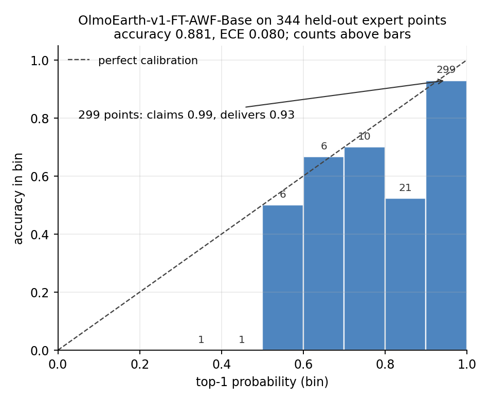

# olmoearth_inferenceX

**A protocol for comparing inference outputs without labels.** Two things
disagree — a model and a reference, two model versions, two explanations for
the same discrepancy. Which do you believe, and is the difference real?

Two applications are demonstrated: **error ranking** and **cross-inference
evaluation**. Signal designs are adapted from LLM hallucination detection,
which faces the same no-reference problem.

## The numbers

AURC ranks the windows the model gets wrong. **Lower is better**, and
<u>underlined</u> marks the best value in each column. A signal counts only
if it beats both the model's own confidence and a pixel statistic computed
with no model at all.

| Signal | AWF<br>in-domain | Barotse<br>wetland margins | Zambezi delta<br>ref. omits river | Sen1Floods11<br>hand labels |
|---|---|---|---|---|
| confidence (baseline) | <u>0.0363</u> | 0.0684 | 0.0234 | <u>0.0105</u> |
| E_system tiling instability | 0.0489 | <u>0.0127</u> | 0.0009 | 0.0115 |
| E_case cross-model | 0.0670 | 0.0235 | 0.0103 | 0.0186 |
| E_dist embedding distance | 0.1338 | 0.0289 | 0.0014 | 0.0592 |
| pixel control (no model) | 0.1658 | 0.0384 | <u>0.0005</u> | 0.0356 |

<sup>
Col 1: AWF expert labels, 63 errors. Cols 2–3: ESA WorldCover 2021, 97 and 29
disagreements. Col 4: hand-labelled flood masks, pooled excess AURC over
81,984 patches on a held-out region (exp18).
</sup>

Columns 2–3 score against WorldCover, a weak map — the delta scene's
reference has no water at all, which is why the no-model control wins there.
**Only columns 1 and 4 score against human labels, and confidence wins both.**



## What we found

- **Confidence beats every audit signal on expert labels** (exp18, exp04,
  exp16), including the fine-tuned model run end to end (exp21).
- **That model is overconfident** — 0.93 accurate where it claims 0.99 — so a
  stated accuracy needs a coverage: 0.945 at 80% (exp21).
- **The WorldCover wins do not transfer, and we do not know why.** Tiling
  instability won 26/27 scenes there (exp13) but not on hand labels;
  reference instability, the year gap and seasonal water were each tested and
  rejected (exp23, exp24, exp25). **Main open question.**
- **Errors concentrate at prediction boundaries** — 75% against 20% — but
  confidence still ranks them better (exp14, exp16, exp18).
- **Two runs help only if they see the input differently**, not if one is more
  accurate; same-family models err together (exp07, exp10, exp17, exp19).
- **The served product exports no class confidence**, so boundary fraction is
  the only cue: median 0.88 of disagreements at a 5% review budget (exp20).

## Install and reproduce

```bash
uv sync                                 # assessment layer only, no torch
uv sync --extra encoder --extra geo     # full experiment environment
uv run python exp/exp02_full_slice.py
```

Experiments are `exp01`–`exp26` in [`exp/`](exp/), with outputs under
`exp/out/`. Torch is pinned per platform — Linux resolves the cu128 build.

## Documentation

| | |
|---|---|
| [Technique ledger](docs/TECHNIQUES.md) | What was tried, one line each — **start here** |
| [Recipe](docs/method/recipe.md) · [Protocol](docs/method/protocol.md) | What to do and not do; how results are scored |
| [Comparisons](docs/results/comparisons.md) · [Signals](docs/results/signals.md) | Per-experiment and per-signal evidence |
| [Task cards](docs/method/taskcards.md) · [Infrastructure](docs/method/infrastructure.md) | What each model is; upstream sources and formats |
| [Agent integration](docs/method/agent_integration.md) | Contract with the OlmoEarth Agent |
| [Roadmap](docs/plan/roadmap.md) · [Lab log](exp/NOTES.md) | Open items; chronology |

*Research code under active development; results are updated in place.*
