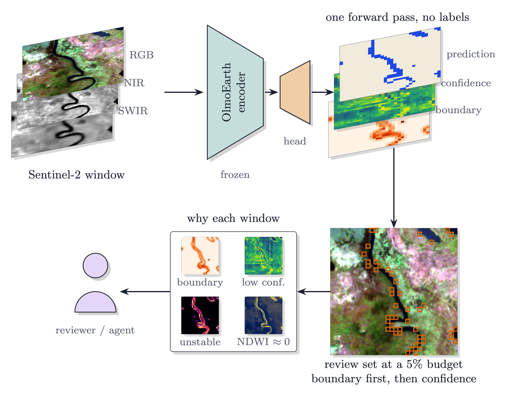
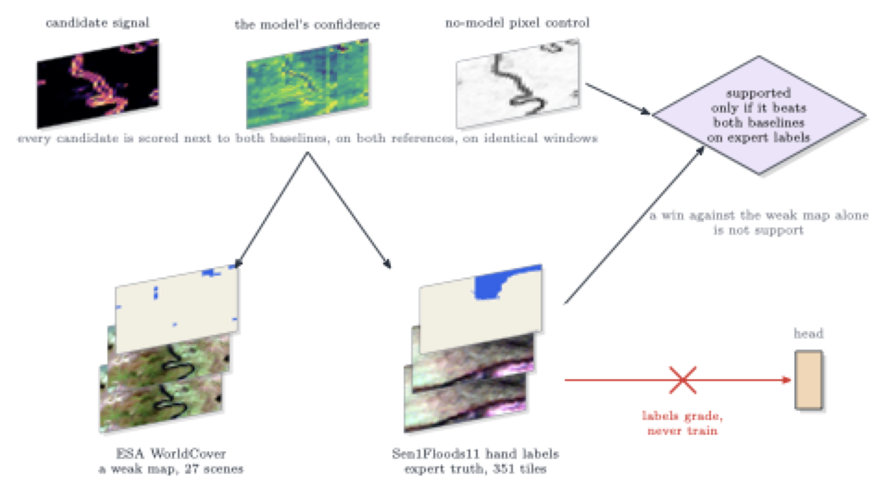

# Findings

What the audit found, what holds up, and how well. Every number traces to a
file under `exp/out/`; the per-experiment detail is in the
[technique ledger](TECHNIQUES.md) and the results pages.

*One scene (okavango_80) through the pipeline: the layers are the actual rasters, the orange squares are the 5% review set in the boundary-first order.*

## What holds

1. **Of the label-free quantities the audit measures, the model's own
   confidence is the one that best predicts where the map is wrong**, with
   one exception. It leads on the AWF points,
   the fine-tuned model run end to end and the multi-region Sen1Floods11
   split, leading or tying under both backbones and both window designs (exp04, exp16,
   exp18, exp21, exp45, exp47, exp49). The exception is Sen1Floods11 <!-- claim:confidence-best-single-signal -->
   Bolivia, a single flood event, where a no-model spectral index ranks the
   model's errors within 0.002 of its own confidence under v1 and better under
   v1.2 Base, the encoder the served product uses, for the grid window and
   for the shift-averaged decision alike (exp45, exp47): on one event,
   water against land is nearly a spectral threshold, and there a head on
   raw pixel statistics beats the frozen encoder (exp46). <!-- claim:bolivia-ndwi-exception --> <!-- claim:pixel-head-beats-encoder-bolivia -->
   Under Ai2's own Sentinel-1 probe the picture flips: its confidence beats
   the index on Bolivia and loses to it on the multi-region split under both
   backbones (exp51); the index from the other sensor wins wherever the
   model's own sensor is the less informative one for water. <!-- claim:s1-probe-ndwi-flip -->
   Fine-tune the encoder and the exception goes: the trained S2 model's
   confidence beats the index on Bolivia under both backbones (exp52). <!-- claim:finetune-dissolves-bolivia-exception -->
   Over 45 GEOID-Flood events the index beats confidence on 2 for
   permanent water and the sensor control on 1 for post-event water:
   exceptions exist and are rare (exp55). On four multi-class tasks from Ai2's
   embeddings confidence beats the embedding-distance control everywhere
   (exp54). <!-- claim:geoid-exception-rate --> <!-- claim:multiclass-confidence-beats-embedding-control -->
   A bag of bootstrap heads does not improve on it: an apparent gain under
   v1 on Bolivia (exp49) did not replicate with a fresh draw (exp50). <!-- claim:bag-not-replicated -->
2. **Review boundary windows first, then by confidence.** Errors sit on
   prediction boundaries, 75% of errors against 21% of correct windows, and <!-- claim:errors-sit-on-boundaries -->
   this order captures more of them than confidence alone at 5% and 10%
   review budgets on hand labels, preregistered (exp36). No extra inference. <!-- claim:boundary-first-review-order -->
   Its scope is narrower than that sentence: across 45 flood events it beats
   confidence at the 5% budget on 40% of them (exp55), and at 15-19 classes
   it loses pooled while winning per tile (exp54). <!-- claim:geoid-boundary-first-minority --> <!-- claim:boundary-first-many-classes-split -->
3. **Every flagged window comes with a reason.** 95% of the error windows on
   hand labels carry at least one label-free cue with a measured enrichment;
   spectral ambiguity is 7x enriched and the one cue that adds precision
   inside the review set (exp37). <!-- claim:explanation-cues-cover-errors -->
4. **An accuracy needs a coverage.** The fine-tuned model is 0.93 accurate
   where it claims 0.99; keeping the 80% most confident windows gives 0.945 <!-- claim:accuracy-needs-coverage -->
   (exp21).
5. **The served product can be triaged without confidence.** It exports no
   class confidence; boundary fraction alone captures a median 0.88 of the
   disagreements at a 5% review budget (exp20). <!-- claim:served-product-boundary-triage -->
6. **Averaging the tilings improves the map itself.** Run the encoder on the
   window cropped at four offsets and average the four decisions per pixel:
   pixel accuracy on hand labels rises by 1.0 points on Bolivia and 0.9 on
   the multi-region test split, preregistered, no labels, no retraining
   (exp42). Errors concentrate on windows whose hand labels are mixed, but <!-- claim:w1-accuracy-gain -->
   that is concentration, not a ceiling: any one-class-per-block decision
   must miss only 3% of pixels, far below the grid's measured error rate <!-- claim:mixed-label-windows-not-a-ceiling -->
   (exp43).
7. **Fusing signals needs labels, and then it works.** A logistic combination
   of ten label-free signals (confidence, tiling instability, NDWI level, the
   ensemble entropies, embedding distances, input extremity) fitted on the
   head's own training split beats confidence on Bolivia under both backbones
   and on the v1 test split by 24-38% of excess AURC; every label-free
   midrank fusion had lost (exp47, exp49). On the v1.2 test split the lead is <!-- claim:label-fitted-fusion-three-of-four --> <!-- claim:label-free-midrank-fusion-lost -->
   below the worthwhile threshold, so this is three arms of four. The weight
   sits on the no-model NDWI level with the ensemble entropies and confidence
   behind it, and dropping NDWI level costs the most (exp50). Fitted on tile <!-- claim:fusion-weight-on-ndwi -->
   failures instead, it beats confidence at the tile level on the multi-region
   split under both backbones (AURC 0.120 to 0.078 and 0.134 to 0.086), not on
   Bolivia. SHRUG-FM's own signals, ported to the window, do not beat <!-- claim:tile-fitted-fusion-split-only -->
   confidence (exp49). <!-- claim:shrug-signals-rejected -->
8. **Fine-tuning corrects two thirds of the frozen head's Bolivia errors.**
   Training OlmoEarth Base on the Sen1Floods11 train split with Ai2's recipe
   corrects 66% of the frozen head's Bolivia errors and 44% of its multi-region
   errors on identical windows, and takes window accuracy from 0.917 to 0.954
   and from 0.955 to 0.967, preregistered (exp52); exp21's 55.6% on Ai2's AWF
   model sits between the two testbeds. Adding Sentinel-1 to the fine-tuned <!-- claim:finetune-corrects-frozen-errors -->
   Sentinel-2 model adds at most a tenth of a point: the sensor lever exp46
   found on frozen probes is a frozen-feature property (exp52). <!-- claim:s1-adds-little-after-finetune -->

Which differences predict error. Every comparison here is a label-free
measurement of how two inferences of the same scene differ: across shifted
crops (exp42, exp44), backbones (exp45), sensors (exp46), encoders (exp41,
exp51, exp54) and before against after fine-tuning (exp21, exp52). On the
labelled testbeds the model's own confidence is the difference that ranks
its errors; disagreement across crops, backbones or encoders does not rank
them (exp13, exp19, exp41, exp54), but where the error sets move says what
moves them: the tiling is not the cause, since fine-tuning corrects more
than half of the grid's errors on the same windows (exp21) and reading
Sentinel-1 instead of Sentinel-2 moves the <!-- claim:fine-tuning-corrects-half -->
error set twice as far as swapping the encoder (exp46); the sensor is the
largest lever and the backbone the smallest. <!-- claim:modality-dominates-shared-errors -->
On Ai2's own embeddings, with their probe, seven published encoders err on
the same windows as OlmoEarth (phi 0.78-0.82, Satlas 0.62; exp51). That sharing belongs to the binary water
task: on marine debris and crop types the same encoders share far less
(phi 0.26-0.44 and 0.05-0.08; exp54). <!-- claim:cross-encoder-phi-on-their-embeddings --> <!-- claim:shared-errors-task-dependent -->

Measured as differences, without labels (exp57, every pair on identical
windows): two inferences of the same scene disagree on 2 to 4% of the windows
across crop offsets, backbones and encoders and on 8 to 11% across sensors,
and the disagreement sits on prediction boundaries everywhere, 3.3 to 7.1
times as often as the agreement windows on Sen1Floods11 and 21 times on the
median GEOID-Flood event, preregistered. The sensor difference and the <!-- claim:atlas-disagreement-is-boundary-located -->
backbone difference are different sets of windows (phi 0.27 and 0.18 between
their disagreement masks; every pair of differences overlaps at 0.18 to
0.41), preregistered. Which side is right where they disagree is a labelled <!-- claim:atlas-different-differences -->
question, and the label answers it only for the differences that changed the
model: the fine-tuned model is right on 71 to 75% of its disagreements with
the frozen head and the Sentinel-2 head on 67 to 84% of its disagreements
with the Sentinel-1 head, while crop offsets, backbones and six of seven
encoders split their disagreements 39 to 61%. <!-- claim:atlas-which-side -->
Across two dates the axes separate (exp60, GEOID-Flood): a same-period
cross-sensor difference carries none of the later flood (0.4% of its windows
against 19.5% for the mixed pair, on 23 events against 3), while the same-sensor
difference across the event carries 26%, not the doubling preregistered, and more
than half of it is the pre-event radar calling water that neither the label nor the
month's Landsat water product holds (exp61: 0.1% of those windows are water
there). <!-- claim:two-periods-sensor-axis-isolated --> <!-- claim:two-periods-time-only-difference --> <!-- claim:residue-not-seasonal-water -->
Where a clear post-event optical pass exists (WorldFloods v2, 544 chips in 6
events) the fourth cell completes the square: the post-event optical head is
right on 97% of the windows, and the square is dominated by one event where the
pre-event optical optical head finds a quarter of the label's permanent water
(exp62). <!-- claim:fourth-cell-completed -->
At 15 and 19 classes (exp63, Ai2's MADOS and PASTIS embeddings) the sensor and
encoder differences stay different sets, and refitting the head moves under
0.4% of windows against 6 to 25% for a change of encoder; but the boundary cue
locates differences only where boundaries are rare, 3.5 to 6.2 times on MADOS
and 1.7 to 1.8 times on PASTIS, where 50% of windows border another class,
so on dense classes it is the low-margin cue that says where two inferences
differ. <!-- claim:multiclass-boundary-cue-fails-on-parcels --> <!-- claim:multiclass-sensor-vs-encoder-different -->
Where labels exist, fusing the readings with them pays and does not travel
(exp65): a fusion cross-fitted by tile cuts confidence's excess AURC by 20%
and 30%, a cross-fitted side rule beats the raw margin by 8 to 25 points on
every pair, and the same rule moved from frozen heads to the fine-tuned model
falls below the raw margin, so the package binds every fusion to its model
family. <!-- claim:calibrate-ranker-fusion-beats-confidence --> <!-- claim:calibrate-side-rule-held-out --> <!-- claim:calibrate-family-lock -->
On eight-class land cover with our own encoder (exp66, DFC2020, the set Ai2
suggested) the ranking transfers, the margin beating a pixel index by 0.16
excess AURC on every arm, and the sensor axis dominates: Sentinel-2 and
Sentinel-1 differ on 44% of windows against a 1.3% probe-seed floor,
nine times what the same axis moved on water. Grading the same rankers
against a second, twenty times coarser reference reverses this repository's
oldest caveat: a coarse reference penalises a boundary-shaped signal rather
than flattering it, so flattery needs a reference that resolves boundaries at
the prediction's own scale. <!-- claim:dfc2020-margin-beats-pixel-control --> <!-- claim:dfc2020-sensor-difference-dominates-land-cover --> <!-- claim:dfc2020-coarse-reference-penalises-the-boundary-order -->
The recipe also survives contact with a model this project had no hand in
(exp67, Dynamic World's 409 expert-annotated tiles): a served global product's
own margin ranks its own errors better than a control that never sees the
imagery, it beats the naive top-probability confidence which ties on 23% of
windows, and its errors carry the same cues. Its published probabilities,
though, understate its accuracy by about 0.20 at every confidence level: the
numbers that order a review well are not the numbers to threshold on. <!-- claim:dw-margin-ranks-a-production-model --> <!-- claim:dw-published-probabilities-are-underconfident -->
And it survives the grader this project had never had (exp68, LUCAS Copernicus
2022, 11,856 in-situ survey polygons): where a surveyor stood at the point and
never saw a pixel, the margin still beats the best control an operator could
compute by 0.095 of design-weighted excess AURC, on 94 European regions against
32, so what this repository has been measuring is not annotator agreement. Two
things that came with it are worth as much as the result. A probe that memorises
its fit set reverses the ordering of confidence signals, putting the margin last
where a properly regularised head puts it first, so a ranking comparison is only
readable beside its own generalisation gap. And the published practice of
filtering land-cover reference data to large homogeneous units flatters the tool
rather than understating it, by 0.097 of AUROC: the mixed and small units the
convention deletes are where the ranking is weakest. <!-- claim:lucas-ranking-survives-ground-observation --> <!-- claim:lucas-overfitting-inverts-the-ranker-ordering --> <!-- claim:lucas-the-homogeneity-filter-flatters-the-tool -->
The same polygons carry the cleanest difference measurement here: one place read
through two acquisitions 118 days apart changes decision on 31% of polygons
against a 0.3% head-reseed floor, the surveyed class says the near date is the
right side 917 times against 591, and the change rate is phenology, twice as
high on cropland as on woodland. <!-- claim:lucas-two-dates-are-phenology -->

The effect size in a reviewer's units (exp55, 45 GEOID-Flood events): on the
median event the 5% of windows confidence flags hold 88% of the permanent-water
errors and 64% of the post-event water errors, 17.5 and 12.8 times a random 5%. <!-- claim:geoid-capture-effect-size -->

## The numbers

Sen1Floods11 Bolivia hand labels, 81,984 windows, 8.8% of them errors
(exp36, exp37):

| Review budget | Errors caught, confidence order | Errors caught, boundary first | Error rate inside the set |
|---|---|---|---|
| 5% | 0.259 | 0.274 | 0.38 | <!-- claim:boundary-first-review-order --> <!-- claim:review-set-error-rate -->
| 10% | 0.465 | 0.494 | 0.33 | <!-- claim:boundary-first-review-order --> <!-- claim:review-set-error-rate -->
| 20% | 0.749 | 0.732 | 0.26 | <!-- claim:boundary-first-review-order --> <!-- claim:review-set-error-rate -->

Why a window is flagged: share among error windows against correct windows
on the same testbed, with the error rate among windows carrying the cue
(exp37):

| Cue | Errors / correct | Enrichment | Error rate with the cue |
|---|---|---|---|
| on a prediction boundary | 0.750 / 0.214 | 3.5x | 0.25 | <!-- claim:cue-enrichment-table -->
| among the least confident 20% | 0.589 / 0.163 | 3.6x | 0.26 | <!-- claim:cue-enrichment-table -->
| unstable under a tiling shift | 0.583 / 0.164 | 3.6x | 0.26 | <!-- claim:cue-enrichment-table -->
| spectrally ambiguous, NDWI near zero | 0.483 / 0.067 | 7.2x | 0.41 | <!-- claim:cue-enrichment-table -->

Window design (exp42), pixel accuracy on hand labels over the region every
tiling covers:

| Decision | Bolivia, 441 tiles | Test split, 800 tiles |
|---|---|---|
| grid window (one tiling) | 0.897 | 0.941 | <!-- claim:w1-accuracy-gain -->
| shift-averaged (four tilings) | 0.907, better on 321 tiles, worse on 66 | 0.950, better on 583, worse on 78 | <!-- claim:w1-accuracy-gain -->
| share of the grid window's errors on mixed-label windows | 45% (10% of windows) | 58% (10% of windows) | <!-- claim:mixed-label-windows-not-a-ceiling -->
| errors the block geometry actually forces (oracle) | at most 29% | at most 49% | <!-- claim:mixed-label-windows-not-a-ceiling -->
| share of the averaged map's own errors on those windows | 43% | 56% | <!-- claim:mixed-label-windows-not-a-ceiling -->
| segment majority over a spectral partition (exp43) | 0.904, breaks more than it corrects | 0.948, breaks more than it corrects | <!-- claim:segment-majority-rejected -->
| sixteen crop offsets instead of four (exp44) | 0.9074, +0.04 points, below the worthwhile threshold | 0.9507, +0.04 points | <!-- claim:sixteen-offsets-not-worthwhile -->

Fine-tuned AWF model, end to end (exp21, exp36): confidence catches 22% of
the errors at a 5% budget, 39% at 10%, 63% at 20%; the boundary-first order
picks the same 5% set. Selective accuracy is 0.945 at 80% coverage. <!-- claim:fine-tuned-capture-at-budgets -->

## How a claim gets in

A candidate rule or cue is tested on two references at once, the ESA
WorldCover map and hand-labelled flood masks, against the model's own
confidence and four no-model controls. The primary test and its direction
are written down before the run. Scores are tie-aware; scenes vote once
per river; tiles are bootstrapped as clusters. Expert labels grade a rule
and never train it. A win against the weak map alone is not support. The
package tests recompute the recorded numbers from the committed artifacts.
The full rules are in the [protocol](method/protocol.md).

## Limits and the open question

The hand-label testbeds are one flood event (Bolivia) and a multi-region
split of the same dataset, both scored with a linear probe, and the
fine-tuned model contributes 41 errors in 344 windows, so the gains above <!-- claim:fine-tuned-model-audit -->
are real but small, and every Bolivia exception is one event. Tiling instability
wins 26 of 27 scenes and 8 of 8 rivers against the WorldCover map yet not
on hand labels; the decisive test needs adjudicated cells on the eight
rivers ([issue 2](https://github.com/2imi9/olmoearth_inferenceX/issues/2)). <!-- claim:tile-phase-26-of-27-worldcover -->
With Ai2's own Sentinel-1 probe, v1.2 ranks its Bolivia errors worse than v1
pooled but not per tile (173/152, p = 0.13), so the v1.2 exception as a
per-tile finding rests on our S2 head (exp51). <!-- claim:v12-bolivia-their-readout -->
The review set does not buy label efficiency: choosing fine-tuning tiles by
the audit's suspicion is worse than random on the multi-region split at every
budget (exp56). <!-- claim:audit-does-not-save-labels -->
The comparison tool tells a user only modestly more than a raw disagreement
map: on the windows where two inferences disagree the more confident side is
right on 51 to 70%, better than a coin flip everywhere and far below the side
the labels prefer, and the first inference's confidence does not order the
disagreement set (exp58). <!-- claim:tool-vs-diff-resolution --> <!-- claim:tool-vs-diff-targeting -->
Ai2's multi-class embeddings supplied dense few-class testbeds (exp54;
[issue 7](https://github.com/2imi9/olmoearth_inferenceX/issues/7) closed); a
second fine-tuned dense task with expert labels and a spatial split is still
missing (roadmap item 6).

Side product: OlmoEarth v1's pretraining target has effective rank 2, and a
normalised target is 57 to 70% predictable from context (exp32 to exp34,
[issue 11](https://github.com/2imi9/olmoearth_inferenceX/issues/11)). <!-- claim:target-effective-rank-2 -->

## What was tried and rejected

Kept as evidence, one line each with the reason, in the
[technique ledger](TECHNIQUES.md). The short version: no signal derived
from the encoder's internals, its pretraining objective, a posterior over
the probe head, feature-space typicality, a second model of the same
family, or flip-and-rotate consistency ranks errors better than confidence
on expert labels. <!-- claim:no-encoder-internal-signal-beats-confidence -->
