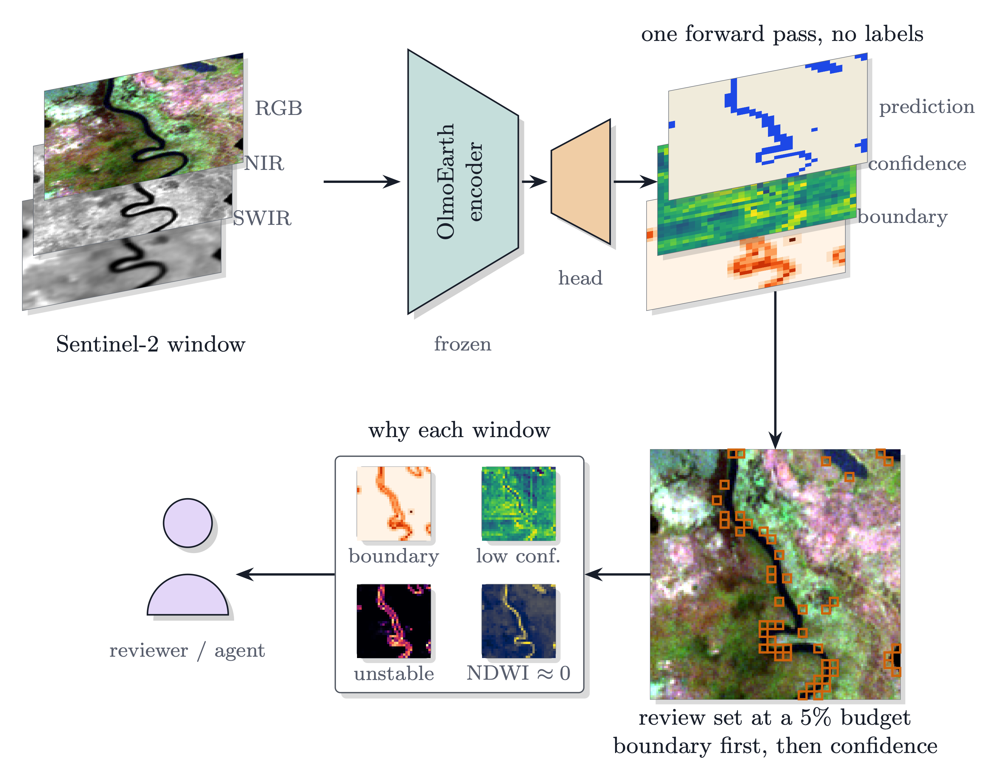

# Summary

This page lists what has been measured about the package, its known limits and how it works, in short. The
[README](https://github.com/2imi9/olmoearth_inferenceX#readme) has the quick start, and [Usage](Usage.md) describes
every command.

## What has been measured

Each line is a claim in the project's ledger, checked against its result file. The
[findings](Findings.md#in-short) list them
all, with the evidence.

- **Ranking.** Ai2's published embedding suite has 25 tasks for OlmoEarth Base. A confidence is
  defined on 24 of them; the other is multi-label. Read through linear probes on those
  embeddings, confidence got a median 0.68 of the way from a random order of the errors to a
  perfect one. <!-- claim:margin-takes-two-thirds-of-the-ranking-headroom -->
  A review of the least confident 10% found a median 0.214 of the errors, about twice a random
  10%. <!-- claim:suite-review-at-ten-percent -->
  Confidence also beat the suite's two baselines, how rare the probe's predicted class is and
  distance in embedding space, on all 24 tasks, but those baselines are near chance on this
  suite, so that comparison shows little. <!-- claim:suite-margin-wins-every-task --> <!-- claim:suite-controls-are-near-chance -->
- **Other encoders.** Sixteen encoders of that suite carry at least 20 of the 24 tasks
  (OlmoEarth, Galileo, CROMA, TerraMind, Clay, Copernicus-FM, AnySat, Panopticon and Satlas).
  Under each of ten probe seeds, confidence ranked the errors better than a random order on
  every task, 3,560 cells in all, though the lowest AUROC, 0.503, is close to chance. <!-- claim:exp79-margin-beats-random-everywhere -->
  It beat both baselines on at least 87.5% of each encoder's tasks. <!-- claim:exp79-headline-holds-under-every-seed-on-every-encoder -->
- **Other references.** Here the baselines carry information, and confidence still beat them.
  Against ground survey labels (LUCAS), confidence ranked the errors better than the best
  baseline computed from the imagery, the variance of the pixels inside a window, in 94 regions
  and worse in 32. Its lead was smaller over a signal read from the map alone, how much a
  window's class disagrees with its neighbours. <!-- claim:lucas-ranking-survives-ground-observation -->
  Against farmers' crop declarations (EuroCrops), it did so in all three countries. <!-- claim:eurocrops-ranking-holds-on-declarations -->
  For Dynamic World, a model this project did not train, the gap between its two highest class
  probabilities beat a class-rarity baseline on 315 expert-annotated tiles and lost on 91. <!-- claim:dw-margin-ranks-a-production-model -->
  That baseline found about twice a random share of the errors there. <!-- claim:external-references-carry-informative-controls -->
- **Error rate.** From 300 randomly drawn windows, a 95% Wilson interval held the true rate in
  93.3% to 96.1% of 2,000 repeated draws, on each of the suite's seven segmentation tasks. <!-- claim:design-based-interval-is-honest -->
  `estimate` now prints the exact hypergeometric interval instead, which covers at least 95% by
  construction.
- **Certified zone.** On OlmoEarth Base's 24 tasks, a certified zone was worse than its level
  in at most 8% of 2,000 draws, where 10% is allowed. <!-- claim:trust-zone-guarantee-holds -->
  On LCMAP's own confidence layer, graded against LCMAP's random reference plots, it was worse
  in at most 6.1% of draws in every cell. At 300 labels and α 8.86% (half the error rate) the
  default rule returned no zone on 87% of draws: the first zone it tests, a tenth of the plots,
  is 6% wrong and holds about 30 labels (exp93, preregistered).
  <!-- claim:exp93-zone-guarantee-holds-on-a-product -->
- **Which map is more accurate.** On 2,514 pairs of the record's probe maps, 100 labels drawn
  where two maps differ named the more accurate map on 60.3% of draws, against 12.7% for 100
  labels from the whole map; on the 1,709 pairs differing on more than 100 windows, where the
  labels are a sample, 42.8% against 11.3%. The interval held its coverage on every pair up to
  the draws' noise (exp90, not preregistered). <!-- claim:exp90-which-map-few-labels -->
- **Published products.** On LCMAP and Esri land cover for 2018, graded against LCMAP's 25,000
  random reference plots, the error-rate interval covered on 95.0% and 95.65% of draws, and labels
  drawn where the maps differ covered their 2.7-point difference on at least 98.5% of draws and
  never named the wrong map; at 50 to 200 labels they named LCMAP on 6% to 29% of draws (exp92,
  preregistered). <!-- claim:exp92-products-labelled-routes-hold -->
  On five more reference samples (NLCD's accuracy-assessment points, JRC's GFC2020 validation
  set, an East Africa random sample, S2GLC in Europe) and seven products from 2001 to 2020, the
  error-rate interval covered on at least 95.05% of draws in all 18 cells, and labels drawn where
  two products differ covered the difference on at least 98.05% and named the worse-agreeing one
  on at most 0.35% of draws (exp94, preregistered).
  <!-- claim:exp94-labelled-routes-hold-on-four-references -->

## Known limits

The [findings](Findings.md#limits) give the
detail.

- **Confident errors.** They are checked last. They are common where a model is run on an input
  combination it was not trained on. Three crop tasks were simulated: a probe trained on
  Sentinel-1 and Sentinel-2 embeddings, then read on Sentinel-1 alone, as under full cloud. On
  PASTIS, the largest, the map was then 73.6% wrong, and 59.8% of OlmoEarth Base's errors were as
  confident as a typical correct window, against 6.0% with both inputs. For OlmoEarth Large the
  share was 12.8% to 13.8%. <!-- claim:missing-optical-errors-are-confident -->
  A probe trained on Sentinel-1 alone was 28.4% wrong and ranked its errors with an AUROC of
  0.79, against 0.83 with both inputs; 3.9% of its errors reached the same threshold, which is
  set by the probe trained on both. <!-- claim:exp88-matched-head-ranks-normally -->
  For the probe trained on both inputs, the share rose on Togo 12, from 10.4% to 48.5%, and fell
  on China 6, from 13.3% to 6.5%. <!-- claim:missing-modality-confident-errors-follow-the-shift-not-the-sensor -->
  No real cloud has been tested.
- **Labels.** Every interval and certified zone describes agreement with the reviewer's labels,
  which the package treats as right. If the reviewer makes mistakes, the true rate can fall
  outside them; how often reviewers err was not measured. Label blind: hide the `map_class`
  column, record the class seen in `reference_class`, then set `wrong` where the two differ.
  A window that cannot be judged can be marked `?`; `estimate` bounds it both ways and `certify`
  counts it as wrong. `estimate --reviewer-false-alarm` and `--reviewer-miss` widen the interval
  for error rates the user states; they are not measured, and `certify` takes none.
- **Kind of model.** Most of the evidence is linear probes on frozen embeddings. Of Ai2's
  fine-tuned models, one was tested: FT-AWF, on 344 validation points. <!-- claim:fine-tuned-model-audit -->
  A second, Forest Loss Driver (109 windows), was run with FT-AWF report-only, its validation set
  too small to grade: a 10% review held 41.5% and 32.0% of the errors, against 19.5% and 18.3%
  for the best no-encoder control, a lead whose 95% interval includes zero on both. <!-- claim:exp89-finetuned-report-only -->
- **Two maps.** Without labels, `compare` cannot say which map is right where they differ;
  labels drawn where they differ (`sample --other`) give an interval on the accuracy difference,
  which names a map only when it excludes zero, and not either map's accuracy. On
  15 pairs of flood maps, trusting the more confident map was right on 51% to 70% of the
  differing windows. <!-- claim:tool-vs-diff-resolution -->
- **Floods.** A plain water index (NDWI) ranked the errors as well as or better than confidence
  on one Sen1Floods11 event, Bolivia. <!-- claim:bolivia-ndwi-exception -->
  For a Sentinel-1 probe it ranked them better on the whole multi-region test split. <!-- claim:s1-probe-ndwi-flip -->
- **Certifying.** `certify` can return nothing. With 300 labels and a level of half the map's
  error rate, it found a zone on most draws on only 14 of 21 tasks. <!-- claim:trust-zone-coverage-at-300-labels -->
- **Labels collected by tile.** The coverage measured above is for windows drawn at random. A
  300-label budget collected as 18 whole tiles and treated as independent gave a 95% interval that
  held the true rate in only 51% to 78% of draws, on six of seven tasks. <!-- claim:tile-sampling-breaks-the-naive-interval -->
  For labels drawn with `--design tiles`, `estimate` corrects for the tiles. As the package
  ships it, that interval held the true rate in 94.5% to 95.4% of draws on five tasks, and fell
  short on Sen1Floods11 (84.3%) and MADOS (68.5%), where a tenth of the tiles hold most of the
  errors. <!-- claim:shipped-tile-design-coverage -->
- **Scope and size.** The package covers single-label classification. Multi-label maps are not
  covered, and a regression map is read by `compare` only. Each command reads the whole raster
  into memory.

## How it works

*One scene through `assess`. The figure shows the `--order boundary_first` option and two cues, tiling instability and NDWI, that only the Python API computes.*

1. **Ranking.** A window's confidence is the mean over its valid pixels of the top class
   probability, or with `--logits` of the gap between the two highest logits, and the least
   confident windows come first. `--order boundary_first` puts the windows on a class boundary
   ahead of the rest.
2. **Comparison.** Two maps are pooled to one window grid. `compare` reports the share of
   windows whose class differs, where they are, and how much more often they sit on a class
   boundary. Across two dates a difference can be real change on the ground, so grading against
   labels requires the labels' date.
3. **Estimation.** `sample` draws the windows by a recorded random design, and `estimate` uses
   that design. The interval is exact hypergeometric for a simple random sample, a Wilson
   interval at the effective sample size for a stratified one, and cluster-corrected for
   labels collected by tile. The last one under-covers where a few tiles hold most of the errors
   (see [Known limits](#known-limits)). With input conditions, each condition gets its exact
   interval and the whole map a union bound of them; a `?` window is counted both ways.
   For two maps, the labels drawn where they differ give an interval on the accuracy
   difference from each map's exact interval (union bound).
4. **Certified zone.** Exact hypergeometric tests run on zones of growing size, most confident
   windows first. They give the largest zone with error rate at most `α`, at error probability
   `δ`. With no error among its labels, a zone needs about `ln δ / ln(1 − α)` labels: 45 at
   `α` = 5% and `δ` = 0.1.

The formulas are in the
[protocol](method/protocol.md#the-estimators-closed-forms),
and the record of each experiment in the
[comparisons](results/comparisons.md).
