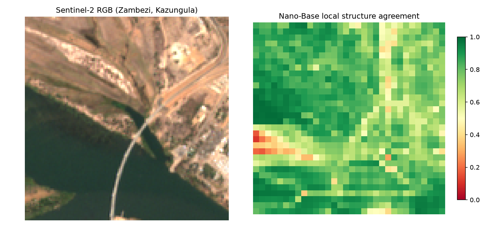
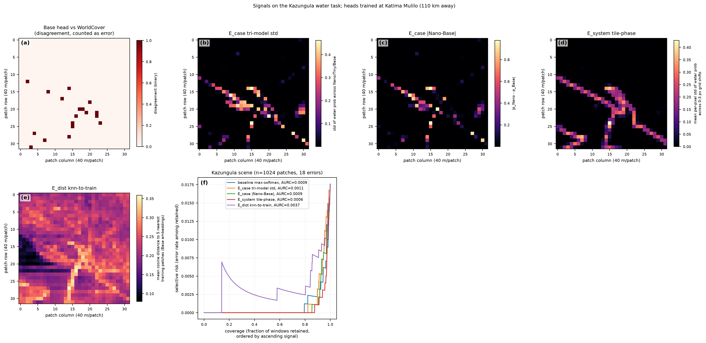
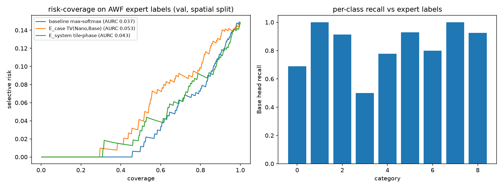
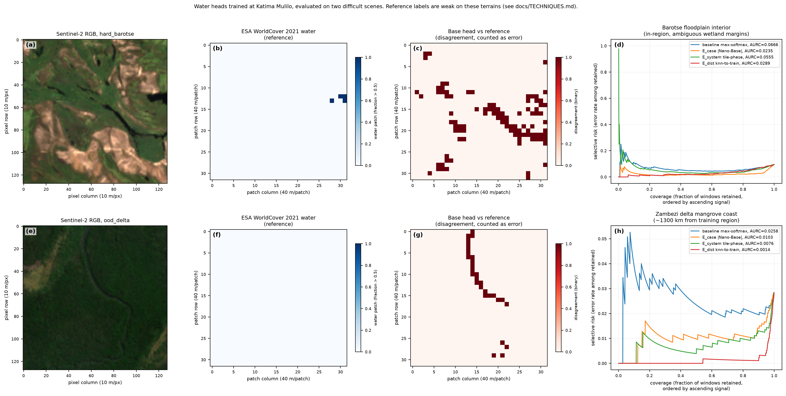
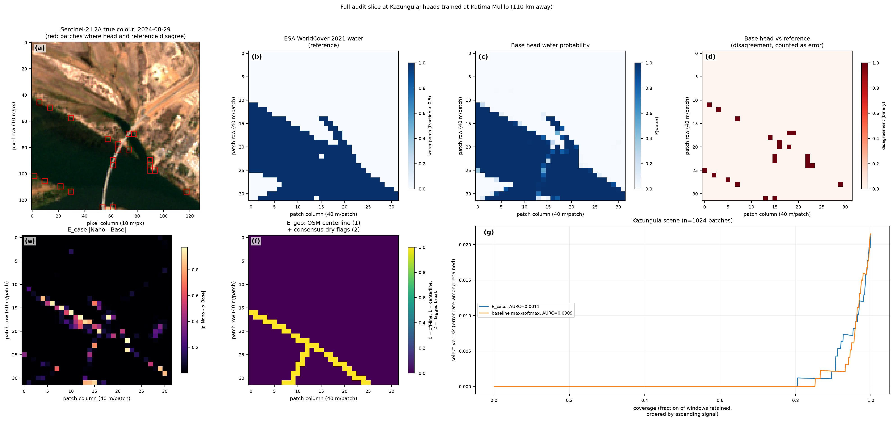

# Technique ledger

Standing record of experimental results, organized by technique rather than by
date. A claim appears here only when an experiment supports it, and is amended
or removed when a later experiment contradicts it. Chronology is kept in
exp/NOTES.md. Every entry cites the experiment script that produced it.

Status terms: **supported** (at least one experiment consistent with the
technique's claim, under the stated conditions) / **mixed** (results differ
across conditions) / **partial** (some evidence; a key condition untested) /
**untested** / **blocked** / **out of scope (v1)**.

All AURC comparisons below come from single scenes or single tasks with small
error counts and no significance testing. They establish direction and
motivate replication; they do not establish effect sizes.

## Summary

| Technique | Related LLM-domain method | Status | Open items |
|---|---|---|---|
| Cross-model disagreement (E_case) | self-consistency / SelfCheckGPT | mixed | lower AURC than the confidence baseline on a wetland-margin scene (0.0235 vs 0.0666); higher AURC in-domain on AWF (0.0533 vs 0.0367). Reference-label quality limits the wetland result. Aggregation across >2 models unresolved |
| Geographic grounding (E_geo) | retrieval-grounded fact checking | partial | specificity observed (no false break alarms on one scene); sensitivity untested, no scene with a confirmed consensus break evaluated yet |
| Perturbation stability (E_system, tile-phase) | sampling-consistency methods | mixed | lower AURC than baseline on one easy binary scene (0.00058 vs 0.00089) and one shifted scene (0.0076 vs 0.0258); higher than baseline on AWF multiclass (0.0427 vs 0.0367) |
| Backbone-version comparison (E_system, v1 vs v1_2) | n/a (EO-specific) | blocked | v1_2 checkpoints fail to load with the current olmoearth_pretrain checkout (state_dict mismatch); requires the newer loader |
| Embedding dissimilarity (E_dist) | internal-state probing (INSIDE, semantic entropy probes) | partial | does not rank in-domain errors (AURC 0.00365 vs baseline 0.00089). The apparent advantage under domain shift (0.0014 vs 0.0258) did not survive the image-statistic control: trivial NDWI statistics rank the same disagreements better (0.0005), so no shift-condition claim is currently supported (exp06). Requires a shift testbed with non-trivial errors |
| Max-softmax confidence (baseline) | logit-based confidence | supported | lowest AURC of all signals tested on in-domain tasks; highest AURC on the two hard scenes. All channel claims are relative to this baseline |
| Risk-coverage / AURC harness | selective prediction | supported | lacks confidence intervals and significance tests; required once scene counts grow |
| Validation on labeled data (labels grade signals, never train them) | pseudo-label validation (PPE §2.3.1) | supported | executed with AWF expert labels and the project's own spatial split; WorldCover remains the reference on unlabeled-region scenes |
| Semantic-entropy port (cluster-then-entropy) | Farquhar et al. 2024 | untested | possible refinement of the perturbation signal |
| Verifier head trained on labeled regions | learned verifiers / reward models | out of scope (v1) | requires labels as training input |
| Channel fusion | n/a | out of scope (v1) | per-channel reporting only; rank aggregation if a single ordering is required |

## Results

### Production inference exports (allenai/olmoearth_lcc)
- The published continent-scale LCC run (encoder OlmoEarth-v1.2-Base,
  32768x32768-pixel UTM tiles) provides 9-band uint8 summary rasters: band 1
  binary-change probability (scaled 0-255), bands 2-5 argmax classes, bands
  6-7 the probability of the argmax class, bands 8-9 month-encoded change
  dates. The export format therefore carries partial probability information
  (top-1 score and one binary-head probability), not full per-class
  distributions. (Documented in the dataset README.)
- The rasters are cloud-optimized GeoTIFFs on public storage; windows can be
  read over HTTP without bulk download.
- Caveat for any validation against the olmoearth_lcc annotations: most
  collection phases used output-based labeling (model proposes candidates,
  annotators verify), so label locations are correlated with model beliefs.

### Infrastructure
- The olmoearth_pretrain base dependency set suffices for inference (torch,
  einops, huggingface_hub, numpy); CPU inference handles 128x128-pixel windows
  at patch size 4. (exp/smoke_test.py)
- All encoder checkpoints are public: v1 Nano/Tiny/Base/Large, v1_1
  Nano/Tiny/Base, v1_2 Nano/Tiny/Small/Base, plus fine-tuned variants (AWF,
  LFMC, Mangrove, ForestLossDriver, EcosystemTypeMapping). Multi-model and
  cross-version signals require no private infrastructure.
- Planetary Computer Sentinel-2 L2A and ESA WorldCover can be read onto a
  shared 10 m grid; OSM Overpass requires mirror fallback.

### Cross-model disagreement (E_case)
- Reference point: mean local-similarity-structure agreement between Nano and
  Base on random input is approximately 0.59, not 0, because the models share
  patchification and input normalization. Agreement values must be interpreted
  relative to this floor. (exp/smoke_test.py)
- Disagreement is spatially structured: it concentrates at class boundaries
  and thin structures (shoreline, a bridge) at both the embedding level and
  the prediction level. (exp/exp01, exp/exp02)

  
- On a dry-season scene with a ~400 m river (Base error rate 2%), pairwise
  |p_Nano - p_Base| did not achieve lower AURC than max-softmax (0.0011 vs
  0.0009). (exp/exp02)
- On a floodplain-interior scene with ambiguous wetland margins (97 error
  patches), the same signal achieved substantially lower AURC than
  max-softmax (0.0235 vs 0.0666), subject to the reference-label caveat
  below. (exp/exp05)
- Equal-weight aggregation over three models performed worse than the best
  pairwise signal (AURC 0.00105 vs 0.00086) when one model (Tiny, accuracy
  0.951 vs 0.973/0.982) was substantially weaker; the same pattern recurred
  on AWF with Nano (accuracy 0.756) as the weak member. Multi-model
  aggregation appears to require reliability weighting. (exp/exp03, exp/exp04)

### Perturbation stability (E_system, tile-phase)
- Shifting the input window origin by 1-3 pixels (sub-patch phase) and taking
  the standard deviation of predicted probability across shifts produced
  lower AURC than max-softmax on the easy binary scene (0.00058 vs 0.00089;
  18 error patches) and on the domain-shifted scene (0.0076 vs 0.0258), and
  higher AURC on the AWF multiclass task (0.0427 vs 0.0367). The signal map
  traces the shoreline continuously. (exp/exp03, exp/exp04, exp/exp05)

  

### Embedding dissimilarity (E_dist)
- Mean cosine distance to the k=5 nearest training patches did not rank
  in-domain errors (AURC 0.00365, vs baseline 0.00089). (exp/exp03)
- Under geographic domain shift (~1300 km) the same statistic achieved AURC
  0.0014 vs baseline 0.0258, but this did not survive the no-model control:
  trivial NDWI statistics achieved 0.0005 on the same disagreements (exp06).
  The out-of-distribution-indicator interpretation remains plausible but is
  currently unsupported by a scene where it outperforms image statistics.
  (exp/exp05, exp/exp06)

### Validation against expert labels (AWF)
- The full pipeline runs against the AWF partner dataset: 1459 expert-labeled
  points, 12-month Sentinel-2 stacks, the project's own 1115/344 spatial
  split. A linear head on frozen Base embeddings reaches 85.2% validation
  accuracy (the project's fully fine-tuned model: 89.5%), giving 51 errors
  for signal evaluation. (exp/exp04)
- On this in-domain multiclass task, max-softmax achieved the lowest AURC
  (0.0367) of the signals tested (tile-phase 0.0427, Nano-Base total
  variation 0.0533). (exp/exp04)
- Lowest per-class recall: herbaceous wetland (0.50, n=6 validation points, so
  indicative only). Class-index-to-name mapping verified against the per-class
  metric definitions in olmoearth_projects awf model.yaml. (exp/exp04)

  

### No-model image-statistic controls (exp06)
- Control signals computed directly from pixel values (within-patch spectral
  variance, patch-mean |NDWI| proximity to the water/land boundary, NDWI
  gradient magnitude), scored on identical errors with the same harness.
- Kazungula: every model signal retains a margin over the best control
  (tile-phase 0.00058, |Nano-Base| 0.00086 vs spectral variance 0.0012).
- Barotse floodplain: E_case retains a margin over the best control (0.0235
  vs NDWI gradient 0.0384). The wetland-margin result therefore does not
  reduce to edge detection.
- Zambezi delta: all three no-model statistics rank the disagreements as well
  as or better than every model signal (NDWI gradient 0.0005 vs E_dist
  0.0014). The delta scene's disagreements are spectrally trivial (the river
  the reference misses), so this scene supports no claim of model-signal
  superiority; the E_dist shift claim is withdrawn pending a shift testbed
  with non-trivial errors.
- Secondary observation: on both difficult scenes, even no-model statistics
  rank errors better than max-softmax confidence, underlining how weakly
  informative the model's own confidence is there.

### Hard scenes and domain shift (exp05)
- Water heads trained at Katima Mulilo were evaluated on (a) the Barotse
  floodplain interior (ambiguous wetland margins, in-region) and (b) the
  Zambezi delta mangrove coast (~1300 km from the training region). On both
  scenes, every channel tested achieved lower AURC than max-softmax
  (floodplain: E_case 0.0235, E_dist 0.0289, tile-phase 0.0555, baseline
  0.0666; delta: E_dist 0.0014, tile-phase 0.0076, E_case 0.0103, baseline
  0.0258). (exp/exp05)

  

- Reference-label caveat: ESA WorldCover is least reliable on exactly these
  terrains. On the delta scene, the disagreements between model and reference
  trace a narrow river that WorldCover plausibly misses, so an unknown
  fraction of the counted "errors" may be reference errors rather than model
  errors. The signals rank model-reference disagreement correctly; whether
  that equals model error requires expert-labeled replication.
- Combined statement of exp02-exp06, stated conservatively: on the in-domain
  tasks evaluated, max-softmax confidence produced the best error ranking. On
  the ambiguous-wetland scene, cross-model disagreement produced the best
  ranking and retained its margin over no-model image statistics. On the
  domain-shift scene, model confidence performed worst but no model signal
  outperformed trivial image statistics, so only the negative claim about
  confidence is supported there. Each condition has been observed once.

### Geographic grounding (E_geo)
- On a scene where the river is clearly resolved, the OSM centerline
  consistency check produced zero false break alarms (52 centerline patches,
  0 flagged). This is evidence of specificity only; no scene with a confirmed
  consensus break has been evaluated, so sensitivity is unknown. (exp/exp02)

  

### Heads and spatial transfer
- Linear heads on frozen embeddings transfer spatially: trained on one river
  reach, 97-98% accuracy against WorldCover on a reach ~110 km away.
  (exp/exp02)
- WorldCover-as-reference carries temporal drift (2021 labels vs 2024 scenes),
  so a fraction of measured "model error" is label noise.

## Open items, in priority order

1. A domain-shift testbed with non-trivial errors and expert labels
   (candidate design: geographic-corner holdout within the AWF dataset). The
   delta scene is disqualified as evidence by the exp06 controls.
2. E_geo sensitivity: evaluate on a scene containing a confirmed consensus
   break and measure whether the centerline check detects it.
3. Reliability-weighted multi-model aggregation (Dawid-Skene direction),
   motivated by the twice-observed weak-member effect.
4. v1 vs v1_2 comparison on identical windows; requires updating the
   olmoearth_pretrain checkout for the v1_2 loader.
5. E_dist formalization: AOA/Dissimilarity Index (Meyer & Pebesma 2021) in
   place of raw k-NN distance; delineate overlap with SHRUG-FM (CVPR 2026
   EarthVision) before claiming novelty.
6. Confidence intervals and significance testing for AURC comparisons once
   multiple scenes per condition exist.
7. Confirm whether Studio per-project exports match the olmoearth_lcc export
   format (partial probabilities).
8. Replace OSM centerlines with GRIT, which adds width attributes that E_geo
   can condition on.
9. Audit a window of the published LCC production output directly (HTTP
   range reads) against river centerlines.
