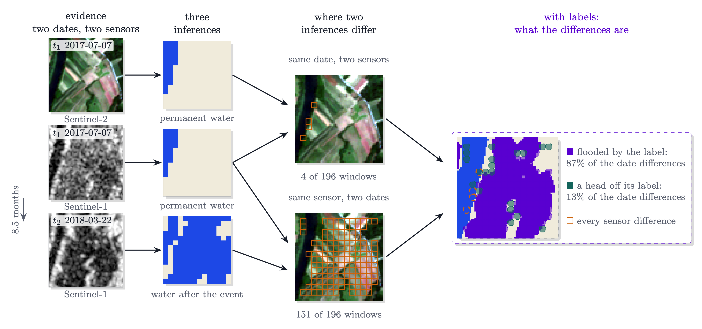

# Usage

This page describes the inputs the package accepts, the `oe-inferencex` commands and the Python functions behind
them. The evidence for each method is in [Findings](Findings.md) and, per experiment, in
[Comparisons](results/comparisons.md).

## Installation

```bash
pip install olmoearth-inferencex            # the package; no torch
pip install "olmoearth-inferencex[geo]"     # with GeoTIFF input and output
```

The package requires Python 3.11 to 3.13. Without the `geo` extra, which brings rasterio, the commands read and write `.npy` arrays.

The input-condition layer below (`--condition`, `condition=`) and the MCP server (`oe-inferencex mcp`, the `mcp`
extra) are new in 1.4.0.

## Quick start

Every command below runs on 1.7.0. `scores.tif` is a map of per-class probabilities; add `--logits` for logits.

```bash
pip install "olmoearth-inferencex[geo]"
oe-inferencex demo                                   # a real map shipped with the package; needs no data
oe-inferencex assess scores.tif --out audit          # which windows to check first; no labels
oe-inferencex sample scores.tif --budget 300 --design random --out to_label.csv
# fill the `wrong` column of to_label.csv with 1 or 0 on every row
oe-inferencex estimate to_label.csv                  # the error rate with a 95% interval
oe-inferencex certify to_label.csv --alpha 0.10      # the certified zone
```

`--design random` lets one set of labels serve both `estimate` and `certify`. Without it `sample` stratifies by
confidence, which `estimate` reads and `certify` refuses. `certify` can return nothing, and says so;
[certify](#certify) gives the labels a level needs. The worked example below shows the lines these commands print on
a test map, and `examples/quickstart_map.py` writes that map and fills in its labels. Each command is described under
[Command line](#command-line).

### A worked example

The steps below run on a test map. Download the script that writes it:

```bash
curl -O https://raw.githubusercontent.com/2imi9/olmoearth_inferenceX/main/examples/quickstart_map.py
python quickstart_map.py
```

It writes three files. `scores.tif` is a synthetic four-class probability map of 256 x 256
pixels. Of its windows, 7.3% are wrong. `other.tif` is a second map of the same scene.
`truth.tif` holds the class that is really there. The lines below were printed on these files,
so you can run each command and compare. Without the package installed,
`uv run --with "olmoearth-inferencex[geo]" python quickstart_map.py` writes the same files.

**1. Which parts to check first.** No labels are needed. Add `--logits` if the scores are
logits.

```console
$ oe-inferencex assess scores.tif --out audit
4096 windows of 4 px; review sets 1%: 41, 5%: 205, 10%: 410; boundary windows 40.0%
wrote audit/assessment.json, explanation.json, review_set_*.csv, suspicion, boundary
```

`audit/review_set_05pct.csv` lists the 5% review set, least confident first, with each
window's pixel and map coordinates. There is one such file for 1% and for 10%.
`explanation.json` gives the cues of each of those windows: whether it sits on a boundary
between two classes of the map, and whether it is among the least confident 20%.
`suspicion.tif` is the ranking as a raster.

**2. How wrong the map is.** This needs labels, and `sample` picks the windows. The recorded
experiments used 300.

```console
$ oe-inferencex sample scores.tif --budget 300 --design random --out to_label.csv
300 windows to label of 4096 valid (random design); wrote to_label.csv and its .json. Fill the `wrong` column with 1 or 0 per window, or ? where a window cannot be judged (keep its row), then run: oe-inferencex estimate to_label.csv
warning: probability input: confidence ties where probabilities saturate. For two classes, logits avoid the ties; for more than two, keep the probabilities (exp76)
```

The warning is printed for every probability map. This one has four classes, so keep the
probabilities (see [Inputs](#inputs)).

Open `to_label.csv`. For each row, look at the window in imagery or on the ground. Set `wrong`
to 1 if `map_class` is not what is there, otherwise to 0, or `?` where it cannot be judged. To label
blind, hide the `map_class` column, write the class you see in `reference_class`, and set `wrong`
where the two differ. Fill every row, keep the row order,
and keep `to_label.json` beside the CSV. On the test map,
`python quickstart_map.py --label to_label.csv` does this from `truth.tif`.

```console
$ oe-inferencex estimate to_label.csv
error rate 7.0%, 95% interval 4.5% to 10.4% (half-width 2.9 points), from 300 labelled windows of 4096; exact hypergeometric interval (simple random sample of a finite map)
wrote to_label_estimate.json
```

`sample` does not write a `reference_class` column. Add one holding the class that is really
in each window, and `--per-class` gives each class's accuracy. The script adds it on the test
map.

**3. Which part can be trusted.** The same labels give a **certified zone**: the most confident
share of the map whose error rate is at most the level `--alpha`. The statement may be wrong for
at most 10% of the samples that could have been drawn (`--delta`).

```console
$ oe-inferencex certify to_label.csv --alpha 0.05
the 90% most confident windows (3686 of 4096, confidence margin >= 0.6662) are wrong at most 5% of the time; this statement fails on at most 10% of samples like this one (prefix rule; the exact upper bound on the zone's error rate at that level is 2.4%). Outside the zone nothing is certified.
prefix rule: fixed-sequence testing, valid on any map whatever the shape of its error rate; it stops at the first zone it cannot certify, so it certifies little when the most confident windows hold many errors, where the bonferroni rule can certify more
wrote to_label_zone.json and the window mask to_label_zone.npy
```

In these lines `confidence margin` is the window's confidence (for this probability map, the
window mean of the top class probability), and `prefix rule` is the default test. `certify` can return nothing: with `--alpha 0.01` the same labels gave `no zone certified`.
It needs a sample drawn with `--design random`. Without that option `sample` stratifies by
confidence, which `estimate` reads and `certify` refuses.

**Two maps of one area**, on the same grid:

```console
$ oe-inferencex compare scores.tif other.tif --out diff
507 of 4096 windows differ (12.38%); on a boundary of a 2.6x as often as the agreeing windows
wrote diff/comparison.json, differing_windows.csv, disagreement
```

The second figure says that the differing windows sit on a class boundary of the first map
2.6 times as often as the agreeing windows. `compare` does not say which map is right there.
With a raster of labels it does: add `--labels truth.tif`. With labels on a few of the differing windows
instead, `sample scores.tif --other other.tif` and then `estimate` say which map is more accurate
([Which map is more accurate](#sample-and-estimate)).

## Inputs

A map is a GeoTIFF or `.npy` array of the scores a model's classification head produces before the argmax: `(H, W)`
probabilities or logits for a binary task, `(C, H, W)` per class otherwise. For a binary task logits are preferred,
because probabilities tie where they saturate; pass `--logits` (`is_logit=True` in Python). For a map of more than
two classes, pass probabilities to the command line: with `--logits` it ranks by the logit margin, and the package
warns that one minus the top probability ranks errors better ([exp76](results/comparisons.md#which-confidence-which-statistic-which-aggregator-exp76));
in Python, `form="top1"` reads logits that way. Other maps are accepted with restrictions.

| Map | Accepted by |
|---|---|
| Hard class map with an exported confidence band, as published products ship them (LCMAP's `lcpri` with `lcpconf`) | `assess`, `sample`, `estimate` and `certify` with `--confidence BAND` (`assess_classmap` in Python). The band must rise with confidence; negate an uncertainty band first. `--confidence-range LOW HIGH` leaves out band values outside it, such as codes; without it the package cannot tell codes from confidences. The band ranks only the pixels it separates. `sample` then defaults to the random design, since the confidence design needs a top-1 probability |
| Hard class map alone | `compare` only; without a confidence there is no ranking |
| Binary score in [0, 1] decided at 0.5, such as an OlmoEarth Studio `per_pixel_regression` output of a two-class task | Everything a binary probability map is, passed as one: windows are ranked by distance from 0.5, which needs no calibration, and a design-based estimate stays valid, since the score only allocates the labels. The score is not a probability of error, and no recorded experiment grades this case |
| Continuous map, such as a regression output | `compare` only, at a cut-off named with `--threshold`; no recorded experiment grades this case |

For a published product, pass the class map as the map and its confidence band with `--confidence`:

```bash
oe-inferencex assess lcpri_2018.tif --confidence lcpconf_2018.tif --confidence-range 1 100 --out audit
oe-inferencex sample lcpri_2018.tif --confidence lcpconf_2018.tif --confidence-range 1 100 --budget 300 --out to_label.csv
oe-inferencex certify to_label.csv --alpha 0.10      # after the reviewer has filled `wrong`
```

The range matters. LCMAP writes provenance codes from 151 into `lcpconf`; read as confidences they would rank above
every real one and sit at the top of any certified zone, where they are wrong more often than the rest
([exp93](results/comparisons.md#the-certified-zone-on-a-published-product-exp93): 29.1% against 17.7%). Without
`--confidence-range` the whole band is read and a note says so. With it, the pixels outside are left out of the
population, so every rate and zone is about the rest: `estimate` and `certify` say how many were left out. The window's
class is the majority of its pixels' classes and its confidence the mean of the band over them, as for scores;
`estimate` and `certify` read both layers again from the paths the sample's sidecar records (`--confidence` there
points to a band that has moved). `--nodata` applies to the class map; the band's no-data is its own file's. On LCMAP,
300 random labels rarely certify a zone at a useful alpha (exp93: none on 87% of draws at half the error rate); a
larger sample, or `estimate` alone, may be the useful step.

The package works on square windows of `--patch` pixels (default 4). A window's confidence is the mean over its valid
pixels of each pixel's confidence, and its class the majority class of its pixels; a window less than half valid is
left out. A pixel's confidence is its top class probability for class probabilities, the gap between its two highest
logits with `--logits` (with `form="top1"` in Python, the log of its top probability), and for a two-class map the
distance of the probability from 0.5, or the absolute logit. The experiments graded a close relative: the margin
between the two highest class probabilities of the window's mean probabilities. exp76 compares the forms. No-data comes from the raster's no-data value, from NaN or from `--nodata`.

**The input condition.** Without a layer `assess` ranks every window with every other. Where part
of a map was predicted from an input combination the model was not trained on, such as radar alone under cloud for a
model trained on radar plus optical, the model can be confidently wrong there. On PASTIS such a probe of OlmoEarth Base
was 73.6% wrong, and 59.8% of its errors were at least as confident as the typical correct window with full input,
against 6.0% with full input. A probe trained on radar alone was 28.4% wrong and ranked its errors with an AUROC of
0.79, against 0.83 with full input; 3.9% of its errors reached the same threshold, which is set by the probe trained
on both. OlmoEarth Large's share rose only from 5.7% to 12.8-13.8%
([exp88](results/comparisons.md#when-a-modality-is-missing-does-the-confidence-fall-with-the-accuracy-exp88)). If a
model can run with an input missing, compare confidence only between windows read from the same inputs, unless the
model was trained on that input combination. That exception was tested only for a separate probe trained on the
remaining input, not for one model trained with modality dropout. Even a model trained on each input can be wrong more often under one
input than under another (28.3% against 19.7% on a half-cloudy PASTIS map), so the error rate is worth estimating per
condition either way. A map
that records each pixel's input condition can pass it as `--condition` (`condition=` in Python), and each condition is
then also ranked on its own, among windows read from the same inputs. The layer is one integer band on the map's grid,
such as a cloud flag, the modalities present, a sensor id or an acquisition group. A negative value, NaN or the
raster's no-data records none. `--condition-names 0=clear 1=cloudy` names the values; the default name is the value
itself, and "unrecorded" is reserved. A window takes the condition held by most of its pixels that have a prediction
and a recorded condition. A tie, or no such pixel, makes it "unrecorded", and those windows form one more condition,
listed last. A layer with more than 64 values, or with values that are not integers, is refused: bin a continuous
layer, such as cloud fraction, first. A user who wants "any cloud makes the window cloudy" encodes that in the layer.
Fix the layer before labelling: a layer drawn around known errors makes every statement wrong. Do not assume that a
map read from optical input alone needs no layer. Unless its pipeline masked cloud as no-data before predicting, the
model predicted over the cloud, and there it can be confidently wrong. Pass the cloud flag as the layer.

The package refuses what it cannot rank, in Python as on the command line. Probability input outside [0, 1] raises
an error rather than being cut at 0.5 and scored. A review set whose cut-off falls inside a run of equal scores (a
hard mask, a quantized band, a constant map) carries `tied_at_cutoff` and a warning, since the order among the tied
windows is raster position. Without labels, the package does not report how wrong a map is; that requires a labelled
sample (`sample`, then `estimate` or `certify`).

## Command line

`oe-inferencex <command> --help` lists each command's options. Outputs are JSON summaries, CSV tables of windows with
pixel and map coordinates, and rasters on the window grid (GeoTIFF for a GeoTIFF input, `.npy` otherwise).

### demo

`oe-inferencex demo` assesses the expert-annotated Dynamic World tile shipped with the package and prints the share
of its errors each review budget contains. It writes `review_set.png`, the `assess` files (`audit/`) and the tile
(`sample_probabilities.npy`, `sample_truth.npy`) to `oe_inferencex_demo/`. `--made-up` uses a synthetic map.

### assess

`assess` ranks the windows of one map by the model's confidence, least confident first, and writes the review set at
each budget with the cues behind each window. On the demo tile:

```console
$ oe-inferencex assess oe_inferencex_demo/sample_probabilities.npy --patch 1 --out audit
16380 windows of 1 px; review sets 1%: 164, 5%: 819, 10%: 1638; boundary windows 36.8%
wrote audit/assessment.json, explanation.json, review_set_*.csv, suspicion, boundary
```

| File | Content |
|---|---|
| `assessment.json` | Window count, confidence quantiles, boundary share, `warnings`; per budget, the review set and `tied_at_cutoff`; `scope`, what the whole-map order does not show |
| `review_set_05pct.csv` | One per budget (`--budgets`, default 0.01 0.05 0.10): rank, window, pixel and map coordinates, confidence, boundary; with `--condition`, the window's `condition` last |
| `explanation.json` | The cues of each review window, each cue's measured enrichment (`quotes`), the windows no cue explains |
| `suspicion.tif`, `boundary.tif` | The ranking score and the boundary indicator |
| `review_set_05pct_by_condition.csv` | With `--condition`, one per budget: each condition's own review set: `condition`, `rank_in_condition`, window, pixel and map coordinates, confidence, boundary |
| `condition.tif` | With `--condition`: each window's condition value, -1 where none is recorded |

```bash
oe-inferencex assess scores.tif --logits --out audit --condition cloud_flag.tif --condition-names 0=clear 1=cloudy
```

Without `--condition`, `assessment.json` differs from 1.3.1's only by `scope` and by two corrected warning texts, on a
multi-class logit map and on a probability map (see the changelog); nothing `assess` prints changes. `scope`
says that a window predicted from an input combination the model was not trained on can be confidently wrong and come
late in the order (exp88). With
`--condition`, `assessment.json` also records `inputs.condition` and `inputs.condition_names` and adds `conditions`:
the rule above, the counts of windows tied between condition values (`n_windows_split`) and with none
(`n_windows_no_code`), and `per_condition`, which gives each condition's share of the map, its confidence quantiles,
its class shares, its share of each whole-map review set and its own review sets. A condition's review set is the
whole map's order kept to that condition, at the same budget of that condition's windows. The class shares are
descriptive only; no experiment has tested whether a difference between conditions signals errors. One printed line
lists every condition, with its share of the map and of the 5% review set, or of the review set whose budget is
nearest 5%. With two or more conditions, `scope` says that the whole-map sets rank the conditions together and that
the ranking inside a condition read from inputs the model was not trained on can be weak: on PASTIS the margin's AUROC
for errors was 0.59 for a probe trained on radar plus optical and run on radar alone, against 0.83 on both inputs and
0.79 for a probe trained on radar alone (exp88). Which condition is more accurate needs labels.

`--order boundary_first` reviews the windows on a class boundary first, then the interior, each by confidence; the
[Recipe](method/recipe.md) states when to use it. `--reference labels.tif`, an integer class raster on the same grid,
adds `against_reference`: the error rate, the errors captured at each budget, the AURC beside the random and oracle
baselines, and the caveat that another product's map used as a reference can flatter boundary-type signals
([exp18](results/comparisons.md#dense-flood-masks-sen1floods11-exp18)).

### compare

`compare` measures where two maps of the same area differ and, with labels, which map is right where they differ.

```bash
oe-inferencex compare a.tif b.tif --out diff --labels reference.tif --groups tiles.tif
```

It writes `comparison.json` (`disagreement_rate`, `per_group` for the ids in `--groups`, `where` for the boundary
cue's enrichment among the differing windows, `dates`, `notes`), `differing_windows.csv` and `disagreement.tif` (NaN
where nothing was compared). `--labels` adds `graded`, computed over the windows with a majority label: `which_side`,
how often each map matches the label where they differ, and `crosstab`, the errors of `a` that `b` corrects, those it
adds and those both make.

Class maps are read as integers, a single-band probability map is cut at `--threshold` (0.5 when omitted), and a
multi-band score map is argmaxed; a continuous map outside [0, 1] needs `--threshold`. The maps, `--labels` and
`--groups` must share one grid; another CRS or origin is refused. Windows are compared where both maps predicted. A
window whose pixels split evenly between two classes goes to the more confident pixels, or is left out and noted
when either map is a hard class map.

**Dates.** Where two maps of the same ground at the same time differ, at least one is wrong; across dates the
difference can be real change on the ground. `--date-a` and `--date-b` take a date `YYYY-MM-DD` or a period
`YYYY-MM-DD/YYYY-MM-DD` (a composite or an annual map), and `dates.reading` states what a difference can mean. When
the dates differ, grading is refused until `--labels-date` gives the labels' date, because a window that changed is
right in one map and wrong in the other whatever either model did; `graded.graded_against` then names the map the
labels match in time.

**Which map is more accurate, with few labels.** Where two maps give the same class, both are right or both are
wrong, so their accuracies differ only through the windows where they differ. Label a random sample of those:

```bash
oe-inferencex sample a.tif --other b.tif --budget 100 --out pairs.csv
# the reviewer writes in `reference_class` the class seen in each window (or ? where it cannot be judged);
# hide class_a and class_b to label blind
oe-inferencex estimate pairs.csv
```

`estimate` then says which map is more accurate and by how much, as a 95% interval on the difference in accuracy, a
minus b, over the windows compared: both maps predict them, and where either map is a class map, windows split evenly
between two classes are left out (with scores on both sides a tie goes to the more confident pixels). Each map's share of the differing windows that is right gets its exact interval at 97.5%,
and the difference of the two, scaled by the differing windows' share of the map, covers at least 95% by the union
bound; it is conservative. A window marked `?` is counted for each map both ways. The maps are read as `compare`
reads them (class maps, probability maps cut at `--threshold`, or per-class scores argmaxed), and the windows are the
ones `compare` counts as differing. It does not give either map's accuracy: where the maps agree they are both right
or both wrong, and how often needs a random sample of all windows (`sample --design random` on each map). `certify`
refuses this sample.

On the record's own maps (exp90: every pair of encoders run on the same units of each of the 24 tasks of Ai2's suite,
2,514 pairs, with the full truth, 400 draws per pair; not preregistered; the maps are linear probes, not map products),
100 labels on the differing windows named the right map on 60% of draws. The same 100 labels drawn from the whole map
named it on 13%, analysed on the differing windows they happened to hold. A third of the pairs (805) differed on 100
windows or fewer and were labelled in full; on the other 1,709 the rates were 43% against 11%, with median widths of
8.5 against 18.9 points. The coverage was at least 95% on every pair up to the draws' noise, and a wrong map was named
on at most 4% of a pair's draws. The maps differed on a median 21% of the windows.
<!-- claim:exp90-which-map-few-labels -->

### sample and estimate

`sample` selects the windows to label; `estimate` reads the labels back and reports the map's error rate with a 95%
interval.

```bash
oe-inferencex sample water_prob.tif --budget 300 --out to_label.csv
# the reviewer fills the `wrong` column with 1 or 0 for each window, or ? where it cannot be judged
oe-inferencex estimate to_label.csv
oe-inferencex estimate to_label.csv --per-class    # once a `reference_class` column is filled in as well
```

`sample` writes the CSV (`index`, window, pixel and map coordinates, `stratum`, `confidence`, `map_class`, an empty
`wrong`) and a sidecar `to_label.json` with the design, the scores' path and the grid. With `--condition`, a
`condition` column holding the condition's name follows `stratum`. `map_class` is the majority class of the window's
pixels. **The reviewer sets `wrong` to 1 when `map_class` is not what is on the ground, and to 0 otherwise**;
`estimate` grades that class, not the window's centre pixel. Where a window cannot be judged (cloud, a mixed window,
too little detail), the reviewer writes `?` and keeps the row. The recorded experiments used 300 windows
([exp78](results/comparisons.md#how-wrong-is-this-map-what-a-reviewers-labels-buy-exp78)).

**Windows marked `?`.** `estimate` bounds them both ways: the interval's lower end counts every `?` as right and its
upper end every `?` as wrong, and the estimate is the range between. The exact intervals move one way with the error
count, so the interval still covers at least 95% whatever made those windows hard to judge, even when the hard
windows are mostly the wrong ones (tests/test_unjudged.py checks this by exact enumeration against such an
adversary). Under the confidence and proportional designs the interval is then the sum of each stratum's exact
interval at 1 - 0.05/L, weighted by its share of the map, in place of the Wilson interval, which does not move one
way, and is much wider: under those designs most of the width comes from that switch, not from the `?` windows
themselves. The tiles design and `--per-class` refuse `?`. `certify` counts every `?` as wrong, which certifies less
and keeps the guarantee. Each `?` widens the result, so judging them is worth it where possible.

`estimate` and `certify` treat the labels as right. Their interval and zone describe agreement with the reviewer's
labels; if the reviewer marks correct windows wrong or misses errors, the true rate can fall outside them. No
experiment here measured how often reviewers err. If you can bound it, for example from windows a second reviewer
labelled again, pass the bounds:

```bash
oe-inferencex estimate to_label.csv --reviewer-false-alarm 0.05 --reviewer-miss 0.10
```

`--reviewer-false-alarm E0` is the most the reviewer marks wrong of the windows that are truly right, and
`--reviewer-miss E1` the most the reviewer marks right of the windows that are truly wrong. The labels then show the
rate p = θ(1 - e1) + (1 - θ)e0, so the true rate θ lies between (p - E0)/(1 - E0) and p/(1 - E1), and `estimate`
applies those two maps to its interval's ends. The bounds are sharp, proved in Lean in the repository's `lean/`
folder; tests/test_unjudged.py checks the interval's coverage by exact enumeration against reviewers who err as much
as the bounds allow. The bounds are yours: they are not measured here, and if the reviewer errs more often the result
does not hold. Per input condition they must hold within each condition.

`certify` takes no reviewer error rate. Allowing for misses would mean testing at α(1 - E1), which holds only if the
reviewer misses at most E1 of the wrong windows inside every zone the test can certify. Those are the most confident
windows, where a model's confident errors sit and a reviewer may be fooled too, and a miss rate measured on the whole
map, such as one from a second review of a random sample, does not establish it: misses placed in the confident half
of a map made such a test certify a zone wrong 10% of the time at α = 5% on every draw (review of 2 October 2026). Labelling blind keeps the reviewer from anchoring on the map's
class, though how much that changes the labels was not measured either: hide the `map_class` column from the
reviewer, record the class seen in a `reference_class` column, and set `wrong` to 1 where it differs from
`map_class`.

| `--design` | Draw | Interval in `estimate` |
|---|---|---|
| `confidence` (default without `--condition`) | Strata by confidence margin, budget allocated from the model's confidence | Wilson at the design's effective sample size |
| `proportional` | The same strata, budget allocated by stratum size | The same |
| `random` | Simple random sample; required by `certify` without a condition | Exact hypergeometric; with `--condition`, also exact per condition, graded in exp88 |
| `tiles` | `--per-tile` windows (default 16) in each of a random set of tiles of `--tile` windows per side (default 16) | Ratio estimator over tiles, with the naive interval beside it |
| `condition` (default with `--condition`) | Strata by input condition, labels split equally | Exact per condition; whole map: the conditions' exact intervals at 1 − 0.05/L, weighted by share, at least 95% by construction; per class: not graded |

The tile design matches how reviewers often label, and its intervals can under-cover. On six of exp78's seven tasks
the naive interval covered the true rate 51 to 78% of the time at a nominal 95%. The corrected interval, as `--design tiles`
ships it, covered 94.5% to 95.4% on five tasks and fell short on Sen1Floods11 (84.3%) and MADOS (68.5%), where a tenth
of the tiles hold most of the errors
([exp78](results/comparisons.md#how-wrong-is-this-map-what-a-reviewers-labels-buy-exp78)). The warning `estimate`
prints for a tiles sample quotes these numbers since 1.4.0; 1.3.1's quoted exp78's own design (an exact 18 tiles and a
normal quantile). If labelling has not started, draw single windows rather than tiles. If only the whole-map rate is needed, `--design random` gives the
exact interval and is the design `certify` needs.

**Sampling by input condition.** A map with a condition layer is sampled, estimated and certified
per condition:

```bash
oe-inferencex sample scores.tif --logits --budget 300 --out to_label.csv --condition cloud_flag.tif --condition-names 0=clear 1=cloudy
oe-inferencex estimate to_label.csv                  # the whole map and each condition
oe-inferencex certify to_label.csv --alpha 0.05      # a zone per condition
```

`sample --condition` fixes each window's condition when the sample is drawn and records it in the sidecar
(`condition`, with the names, sizes and labels per condition, and `condition_grid`); `estimate` and `certify` read it
from there and never read the raster again, and a row whose `condition` was edited is refused. The `condition` design
gives every condition the same number of labels: a condition too small for an equal share is labelled in full, and the
others share the rest. The split never reads the model's confidence, which can overstate the accuracy of a condition
read from inputs the model was not trained on: it did on PASTIS for a probe trained on radar plus optical and run on
radar alone, though not on CropHarvest China 6 (exp88). An allocation from it could then starve that condition. `--design random --condition` draws the same windows as without a
layer and only records each window's condition; each condition's count is then left to chance. The `confidence`,
`proportional` and `tiles` designs refuse a layer, and `--design condition` refuses to run without one. The printed
line gives the labels per condition and, for two or more, the labels each needs before `certify` can say anything
about it.

`estimate` writes `to_label_estimate.json` (`estimate`, `low`, `high`, `half_width`, `method`, and `effective_n`
under the confidence and proportional designs). It refuses a blank `wrong`, a `wrong` other than 0 or 1, and rows
other than those the design drew. Without a condition the JSON gains `scope`: a whole-map rate can hide a part read
from other inputs. On a PASTIS map with half its tiles read without the optical input by a probe trained on radar plus
optical, that part's error rate was 74.1% and the rest's 19.7%, while random samples of 300 estimated 46.9% on
average. Read by a probe trained on radar alone, that part was still 28.3% wrong (exp88).

For a sample that records a condition, `estimate` also prints one line per condition and adds `by_condition`,
`per_condition` (per condition: `value`, `n_population`, `share_of_map`, `n_labelled`, `n_wrong`, `estimate`, `low`,
`high`, `half_width`, `method`), `condition_note` and `outside_condition_intervals`, the conditions whose interval
excludes the whole-map rate. A printed note says which of them are worse than the map as a whole and which better.
Each condition's interval is exact hypergeometric, under the condition design and under a random sample alike, and is
its own 95% statement; the intervals do not hold jointly. Under a random sample this was graded: on exp88's
half-cloudy PASTIS map (OlmoEarth Base), each part's interval covered its own rate on 95.6% and 95.7% of 2,000 random
samples of 300. Under the condition design the interval is exact by construction, and the tests enumerate its
coverage. A condition no label fell in reads `estimate: null`, from 0 to 1. Under a random sample the whole-map rate
is the one given without a condition. Under the condition design the whole-map rate weights each condition's rate by
its share of the map. Its interval is built from each condition's exact interval taken at 1 − 0.05/L, where L is the
number of conditions not labelled in full (`conditions_in_interval`); a condition labelled in full enters at its exact
rate. The interval runs from the weighted sum of the lower ends to the weighted sum of the upper ends. At that level
the L intervals hold together at least 95% of the time, and when they do the whole-map rate lies between the two
sums. So the interval covers at least 95% by construction, for every map and every split of the labels; the tests
enumerate it on small maps. It is wider than the usual stratified interval, which adds up the conditions' variances,
would be. When the conditions' error rates are
close, it is also wider than a random sample's exact interval of the same size, which is guaranteed too; a printed
note says so, and that `--design random` can be narrower when only the whole-map rate is needed. The condition design
pays off for the error rates of small conditions, each of which gets an equal share of the labels. A stratified
interval is no way out: with the conditions as strata, it covered 53% of the time on a map of 4,000 windows at 0.5%
wrong beside 200 at 50%, with 150 labels each (exact, by enumeration in the tests).
`design_variance` is the stratified estimate's unbiased variance, for information; the interval does not use it. With
one condition the interval is the random design's exact one.

`--per-class` needs a `reference_class` column (the class the reviewer saw, in the map's class ids) and the map's
scores, from the sidecar's path or `--scores`; `--scores` and `--nodata` are accepted only with `--per-class`. It adds
`confusion_counts`, `overall_accuracy` and, per class, the user's accuracy (the share of windows mapped as the class
that belong to it), the producer's accuracy (the share of windows of the class mapped as it) and `reference_share`,
the error-adjusted share of the map, each with an interval. A class is flagged for fewer than 30 labels
(`few labels`), one to four sampled errors (`few errors`), nearly all windows labelled (`near census`), thin sampling
(`thin strata`), or no window predicted (`never predicted`, producer's accuracy 0). Under the condition design the
same estimators run with the conditions as strata. These per-class intervals have not been graded there, and `method`
and a printed note say so; each condition's error-rate interval is still exact. With one condition the table is the
random design's, numbers and method alike.

**The review set is not a sample.** It is selected to contain errors, so its error rate overstates the map's (1.8 to
5.8 times on exp78's tasks). `sample` draws windows with weights the estimator undoes; the review set has none.

### certify

`certify` returns the largest share of the map, from the most confident window down, whose error rate is at most
`--alpha`, certified by exact hypergeometric tests so that the statement fails on at most `--delta` (default 0.1) of
samples. Outside that zone nothing is certified.

```bash
oe-inferencex sample water_prob.tif --budget 300 --design random --out random.csv
oe-inferencex certify random.csv --alpha 0.05    # after the reviewer has filled `wrong`
```

It writes `random_zone.json` (`coverage`, the certified share; `threshold`, the confidence margin at its edge;
`upper_bound` on its error rate; `note`) and the zone as a window mask, `random_zone.npy`.

- A stratified or tile sample is refused, because the guarantee rests on the labels inside each candidate zone being
  a random sample of that zone.
- `--rule prefix` (default) tests the zones from the most confident share up and stops at the first it cannot
  certify. It is fixed-sequence testing, so it is valid on any map, whatever the shape of its error rate. It
  certifies little when the most confident windows hold many errors; there `--rule bonferroni`, which tests every
  level at δ divided by the number of levels, can certify more. Neither is the more powerful in general (exp80).
- Like `estimate`, `certify` treats the labels as right: the zone's guarantee is about agreement with the reviewer's
  labels.
- When the budget cannot certify the level asked for, `certify` says so. With no error among its labels a zone needs
  about `ln(δ) / ln(1 − α)` labels (`min_labels_to_certify`): 45 at α = 5% and 255 at α = 0.9%, for δ = 0.1.
- The confidence is recomputed from the scores the sidecar names (`--scores` if the raster has moved) and checked
  against the CSV; another raster, or another `--nodata`, is refused.
- Without a condition, the zone JSON gains `scope`: the zone's rate is certified over all its windows together, and
  the part of it read with an input missing can be wrong more often than the rest (exp88).

**Per input condition.** A sample drawn with `--condition`, under the `condition` design or
`random`, is certified per condition, and no whole-map zone is issued for it. `L`, the number of conditions holding at
least `min_labels_to_certify(α, δ)` labels (45 at α = 5% and δ = 0.1), is fixed by the label counts before any label
is read. Each of those conditions is certified inside itself at δ/L, with its own zone order, levels and review-set
check, so all the statements hold together except on at most δ of samples. On that event the certified windows taken
together are wrong at most α of the time. A condition with fewer labels is reported as not tested. So is a condition
whose labels fail its review-set check, with the reason: they sit at its suspect end, as the tool's own review set
would. On `sample`'s own draw that happens rarely, by chance. The other conditions are still certified at δ/L; the
check reads where the labels sit, not what they say, so the split stays valid. The split is needed: conditions each
tested at the full δ can fail together more often than δ. The labels a condition needs before it can certify any zone,
at α = 5% and δ = 0.1:

| Conditions tested (`L`) | 1 | 2 | 3 | 4 | 5 |
|---|---|---|---|---|---|
| δ per condition | 0.1 | 0.05 | 0.033 | 0.025 | 0.02 |
| Labels needed per condition | 45 | 59 | 67 | 72 | 77 |

A condition counted in `L` with fewer labels than its column asks is tested and certifies nothing. The zone JSON
keeps `coverage`, `n_zone`, `threshold` and `upper_bound` null, because the union of the zones is not the most
confident share of the map. It adds `by_condition`, `delta_per_condition`, `n_conditions_tested`,
`certified_share_of_map`, `n_certified` and `per_condition`: each condition's certify result with `tested`, and a
`reason` when it was not tested. The window mask, `<sample>_zone.npy`, is then the union of the certified zones; it is
not written, and a stale one is removed, when nothing is certified. `--delta` keeps its meaning: the probability that
any of the statements is wrong.

### decide

`decide` reads a result that `estimate`, `certify` or `compare` wrote and answers set questions, each with one answer
from a fixed set, so a script or an agent gets a yes, a no or an undetermined instead of a paragraph to read. Nothing
is learned or recomputed: each answer is a rule applied to the interval or the certificate in the file. On the worked
example's results:

```console
$ oe-inferencex decide to_label_estimate.json --ask error_rate_below=0.12 --ask error_rate_below=0.05
error_rate_below=0.12: yes. At 95% confidence, the error rate of the map is below 12.0%: its interval is 4.5% to 10.4%. The rate is agreement with the reviewer's labels, which are assumed right.
error_rate_below=0.05: undetermined. The labels cannot tell whether the error rate of the map is below 5.0%: its 95% interval, 4.5% to 10.4%, lies across it. More labels narrow the interval. The rate is agreement with the reviewer's labels, which are assumed right.
wrote to_label_estimate_decisions.json
```

| Question | Answers | Read from | Rule |
|---|---|---|---|
| `error_rate_below=T` | yes, no, undetermined | `estimate` | the 95% interval lies below T, at or above T, or across it |
| `user_accuracy_above=T`, `producer_accuracy_above=T` | the same, per class | `estimate --per-class` | each class's interval; per-class intervals are nominal |
| `more_accurate` | a, b, undetermined | `estimate` on a sample drawn with `--other` | the interval on the difference excludes 0 |
| `more_accurate` | a, b, tie, undetermined | `compare --labels` | a count against the labels raster, taken as truth; undetermined unless every differing window carries a label |
| `trusted_share` | a share of the map | `certify` | the certified share; 0 when nothing is certified |
| `trusted_share_at_least=S` | yes, undetermined | `certify` | never no: more labels can certify more where the map's error rate is at most alpha |
| `share_differs` | a share of the windows | `compare`, or `estimate` on a sample drawn with `--other` | no labels needed; says nothing about which map is right |

T and S are shares between 0 and 1. "undetermined" means the result does not settle the question; it is not a no. A
question a kind of result holds no evidence for is refused: `more_accurate` on a comparison made without labels, since
two maps that agree can both be wrong. A result with input conditions or classes gives each its own answer, each from
its own interval; the intervals do not hold jointly. Each answer's `because` sentence carries the limit that matters
most and the result's own warnings, and `<result>_decisions.json` holds the answer, the level, the evidence and the
sentence. The `level` is the coverage of the interval behind the answer (0.95; nominal where `exact` is false, as for
the default confidence design, tiles and per-class intervals), 1 - delta for a certified zone, and none for a count
against a labels raster, which has no sampling error but is only as right as those labels. `trusted_share` is the
zone's own size over the map, not the grid's rounded coverage.

## Use from an agent (MCP)

New in 1.4.0. `oe-inferencex mcp` starts a local MCP server on stdio, so that an agent can run
`assess`, `compare`, `sample`, `estimate` and `certify` on your own files. The agent starts the server and talks to
it; nothing is hosted. The tools read the files you pass, the sidecar beside a sample and the scores raster it
records, and write where you say, all on your machine.

**Connect it in one line.** With [uv](https://docs.astral.sh/uv/) installed, this line connects Claude Code to the
server, with nothing else to install:

```bash
claude mcp add --scope user oe-inferencex -- uvx --from "olmoearth-inferencex[geo,mcp]" oe-inferencex mcp
```

`--scope user` makes the server available in every folder. Without it, Claude Code adds the server only to the folder
the line is run in. `uvx` installs the package and its extras into an environment of its own, kept in uv's cache,
and runs the server from there; the first start downloads them, which can take half a minute. To run the server from the repository's `main`
instead, put `"olmoearth-inferencex[geo,mcp] @ git+https://github.com/2imi9/olmoearth_inferenceX"` after `--from`.
Other agents, such as
Claude Desktop, Cursor or the OlmoEarth Agent, take the same command in their MCP configuration:

```json
{
  "mcpServers": {
    "oe-inferencex": {
      "command": "uvx",
      "args": ["--from", "olmoearth-inferencex[geo,mcp]", "oe-inferencex", "mcp"]
    }
  }
}
```

If the agent does not find `uvx`, give its full path as `command`; `which uvx` prints it.

**Or install the package**, and the agent starts the installed command:

```bash
pip install "olmoearth-inferencex[geo,mcp]"
claude mcp add --scope user oe-inferencex -- oe-inferencex mcp     # Claude Code
```

In a JSON configuration the server is then `{"command": "oe-inferencex", "args": ["mcp"]}`. Where the package sits
in a virtual environment, give the full path of its `oe-inferencex`.

**Which model.** Use a strong model. In a pilot on 2 October 2026 (not preregistered), agents answered five questions
through the server on the outputs of two of Ai2's fine-tuned models, FT-AWF and Forest Loss Driver, and a grader
checked every reply against the tools' outputs and the truth. Claude Sonnet's replies kept the tools' numbers and
their limits on all five. Claude Haiku's dropped the limits on most, named the better of two maps without labels and
advised labelling a review set to get the error rate. After the server's texts were changed to carry each tool's main
limit inside its conclusion, two of Haiku's five replies passed and one still gave that advice. estimate and certify
refuse a review set, so a weak model's advice cannot turn into a wrong number, but its reply can still mislead.

**A first question.** The [demo](#demo) tile needs no data of your own. Write it into an empty folder:

```bash
uvx --from olmoearth-inferencex oe-inferencex demo
```

Start the agent in that folder and ask:

> Where should I look first in oe_inferencex_demo/sample_probabilities.npy? Use windows of 1 pixel, and grade the
> order against oe_inferencex_demo/sample_truth.npy.

The agent calls `assess` with `reference`. Its answer is the review set of the demo's picture, graded against the
tile's expert labels, with the same share of the errors as the demo prints. For a test map that the other tools can
run on, `examples/quickstart_map.py` writes `scores.tif`, `other.tif` and `truth.tif`, and fills in a sample's labels
from `truth.tif` (`--label to_label.csv`). It needs numpy and rasterio. With nothing installed but uv:

```bash
curl -O https://raw.githubusercontent.com/2imi9/olmoearth_inferenceX/main/examples/quickstart_map.py
uv run --with "olmoearth-inferencex[geo]" python quickstart_map.py
```

The tools answer four questions, in the standard order. Each tool runs the command of the same name, with the same
numbers and the same refusals. The tool names are unchanged; each tool's title starts with its question.

| The question | The tools | What they cannot do |
|---|---|---|
| Where should I look first? | `assess` | Say how wrong the map is without labels; find the errors the model is sure of, which come last |
| How wrong is the map? | `sample`, then labels from you or a reviewer, then `estimate` | Label a window; check the labels, which are assumed right |
| Which part can I trust? | `certify`, on the labels of a random sample | Promise a zone: with too few labels, or errors among the most confident windows, it certifies nothing and says why |
| Which of two maps is better, and where do they differ? | `compare` | Say which map is better without labels. With labels on some of the windows where they differ (`sample` with `other`, then `estimate`), it says which map is more accurate and by how much, not either map's accuracy |

- **The tools.** They take file paths and an output directory; pass absolute paths. `guide` returns the instructions
  below and every tool's description, under the question the tool answers. `decide` reads a result another tool
  wrote and gives typed answers, as the command does (above).
- **What a tool returns.** JSON with the files written and the summary numbers, and three texts to quote:
  `conclusion` (what it found), `limits` (what it does not show, with the package's own warnings and notes) and
  `next` (what can be done next, with its preconditions).
- **What a tool's description says.** The question it answers, what the tool does, what it needs and what it cannot
  do.
- **The server's instructions.** The four questions in the standard order, each with its tools, as in the table
  above, and a condition layer for each input condition on its own. Then the hard rules: a review set is not a
  sample (`estimate` and `certify` refuse one); `certify` needs a random sample (it refuses the default design);
  without labels `compare` cannot say which map is right; labels are assumed right; ranking needs the scores, not
  only the class map. `assess` refuses a class map of more than two classes, but not a 0/1 map or a class map
  passed with `logits=true`; for those, whose review sets tie, its conclusion says the order is not evidence.
- **A refusal.** A tool error carrying the package's own message, with each command-line option it names written as
  the tool parameter (`--labels-date` becomes `labels_date`).

**Example questions**, on the test map that `examples/quickstart_map.py` writes (`scores.tif`, `other.tif`
and `truth.tif`), each with the tools it uses and what the answer can and cannot be:

- "Where should I look first in scores.tif?" Uses `assess`. The answer is a list of windows to check first, least
  confident first. It is not an error rate, and the errors the model is sure of come last. It needs the model's
  per-class scores: a class map alone is refused, or gives an order that is not evidence.
- "How wrong is scores.tif? Pick 300 windows at random for me to label." Uses `sample`, then `estimate`. In between,
  you set `wrong` to 1 or 0 on every row of the sample, or `?` where a window cannot be judged. The answer is an
  error rate with a 95% interval. No tool
  labels a window, and the interval assumes your labels are right.
- "Which part of scores.tif can I trust at 5% error?" Uses `certify`, on the labels of that random sample. The answer
  is the most confident share of the map that is wrong at most 5% of the time, a statement that fails on at most 10%
  of samples. It can be nothing: with too few labels, or errors among the most confident windows, it certifies no
  zone and says why.
- "Which is better, scores.tif or other.tif, and where do they differ?" Uses `compare`. The answer says where the two
  maps differ, window by window. Without labels it cannot say which map is better; with truth.tif as labels it says
  which is right where they differ. With labels on a few of the differing windows instead, sample with other.tif as the
  second map and then estimate say which map is more accurate.

The extra pins the MCP Python SDK (MIT licence) below version 2, which renamed the server class this module uses.
For an agent that runs the commands itself instead,
[`skills/oe-inferencex/SKILL.md`](https://github.com/2imi9/olmoearth_inferenceX/blob/main/skills/oe-inferencex/SKILL.md)
holds the same teaching as a skill; for Claude Code, copy its folder into `~/.claude/skills/`.

## Python API

The commands wrap functions that take and return arrays. Each result is a dict whose arrays stay in `out["arrays"]`;
`summary(out)` is the JSON-safe view that crosses a tool boundary under the
[agent contract](method/agent_integration.md).

### Assess a prediction and explain the review set

```python
import numpy as np
from oe_inferencex.assess import assess_prediction, summary
from oe_inferencex.explain import explain_review_set
from oe_inferencex.signals import ndwi_level

logits = np.load("water_logits.npy")        # (H, W) binary logits, or (C, H, W) per class
s2 = np.load("s2_window.npy")               # (12, H, W) Sentinel-2 bands, for the spectral cue

out = assess_prediction(logits, is_logit=True, patch=4, budgets=(0.05, 0.10), order="boundary_first")
why = explain_review_set(out, cues={"ndwi_ambiguous": ndwi_level(s2, patch=4) > -0.1})

summary(out)["review_sets"]["0.05"]         # the windows to review first
why["budgets"][0.05]["windows"][0]          # {'row': 28, 'col': 26, 'confidence': 0.48, 'cues': ['boundary', 'low_confidence', 'ndwi_ambiguous']}
why["quotes"]["ndwi_ambiguous"]             # "is spectrally ambiguous ... (48% of error windows vs 7% of correct ones, 7.2x; ...)"
```

- `form="top1"` ranks a multi-class logit map by one minus the top probability; the default remains the logit margin,
  with a warning on such maps ([exp76](results/comparisons.md#which-confidence-which-statistic-which-aggregator-exp76)).
  The command line has no such option: class probabilities passed without `--logits` are ranked by the window mean of
  the top probability, where `form="top1"` takes the window mean of its log.
- `explain_review_set` derives the boundary and low-confidence cues itself. Other cues are boolean arrays of window
  shape, such as spectral ambiguity (above) or tiling instability (`signals.aligned_tile_phase`); cues in
  `explain.CUES` are quoted with their measured enrichment, other names as unmeasured.
- `assess_classmap(hard_map, confidence_band, n_classes, ...)` takes a class map with an exported confidence band.
  The served change rasters export no class confidence; there the boundary is the only cue, and `lcc` reads them by
  HTTP range request.
- `reference=` (class labels, negative for none) adds `against_reference`. Grade on expert labels; never train a rule
  on them.
- `condition=` (an `(H, W)` integer layer, negative or NaN where none is recorded) and
  `condition_names=` (`{value: name}`) add `arrays["condition"]`, the window grid, and `conditions`, as on the command
  line. `pool_condition(layer, patch, predicted)` gives the window grid alone.

### Compare two inferences of the same scene



*Four dated inputs of one GEOID-Flood chip read on identical windows, with the same-date and same-sensor differences;
the labels are set apart
([exp57](results/comparisons.md#the-difference-atlas-every-pair-of-inferences-under-one-measurement-exp57),
[exp62](results/comparisons.md#the-fourth-cell-post-event-optical-from-worldfloods-completes-the-square-exp62)).*

```python
import numpy as np
from oe_inferencex.compare import compare_inferences

z = np.load("exp/out/exp57_masks.npz")                               # two heads' decisions on 55 GEOID-Flood events
ev = z["geoid_event"] == "EMSR275-1"
a, b, ok = z["geoid_s2"][ev], z["geoid_s1"][ev], z["geoid_ok"][ev]    # pre-event S2 head, post-event S1 head, windows both predicted
out = compare_inferences(a, b, ok, labels=z["geoid_y_after"][ev])   # graded on water after the event
out["disagreement_rate"]                                            # 0.094: 3,310 of 35,084 windows
out["graded"]["which_side"]["share_b_right"]                        # 0.79: the S1 head matches the post-event label on 79% of them
flooded = z["geoid_y_after"][ev] & ~z["geoid_y_permanent"][ev]
flooded[out["arrays"]["disagree"]].mean()                          # 0.77: the flood's share of the difference
out["dates"]["status"]                                              # "unstated": no dates were given
```

The heads read different dates, so 0.79 is agreement with the post-event label, and the pre-event map is counted wrong
wherever the flood changed the ground. With `dates=(pre, post)`, `compare_inferences` raises until `labels_date=post`
is given, and `graded["graded_against"]` then records which map the labels match in time.

```python
import numpy as np
from oe_inferencex.assess import summary
from oe_inferencex.compare import compare_inferences
from oe_inferencex.signals import boundary_indicator

z = np.load("exp/out/exp02_cache.npz")      # Nano and Base water probabilities on 1024 windows of Kazungula
a, b = z["p_nano"] > 0.5, z["p_base"] > 0.5  # hard decisions first; the module takes no threshold
lab = z["ev_labels"].astype(bool)           # hand labels on every window
ok = np.ones_like(a)                        # the windows both predicted

out = compare_inferences(a, b, ok, labels=lab, cues={"boundary": boundary_indicator(a) > 0})
out["disagreement_rate"]                    # 0.027: 28 of 1024 windows
out["where"]["boundary"]["enrichment"]      # 5.5x: 86% of differing windows on a boundary of a, 15% of agreeing ones
out["graded"]["which_side"]                 # {'n_disagree': 28, 'a_right': 11, 'b_right': 17, 'neither': 0, ...}
out["graded"]["crosstab"]["phi"]            # 0.43: the two error maps overlap
summary(out)                                # the JSON-safe view, no arrays
```

- Decisions are hard maps; a float map is refused. Everything outside `graded` is label-free.
- `groups=` (an id per window) adds per-group rates and, with labels, `over_groups` of the net correction with a
  one-sided exact sign test; `stability` gives the pairwise phi of several disagreement masks.
- Which side is right where two maps differ is not readable without labels; the module reports both
  ([exp58](results/comparisons.md#is-the-comparison-tool-better-than-the-raw-diff-exp58)).
- `determinism_check(a, b, ok, floor=0.03, margin_a=ma, margin_b=mb)` gates one input inferred under two engines or
  precisions against the reseed floor (2 to 4% in exp57), and `signals.crop_dependence` measures how much a decision
  depends on the crop, for the [adaptive-encoder readiness](plan/vit3_readiness.md) gates.

### Estimate the error rate

```python
import numpy as np
from oe_inferencex.assess import assess_prediction
from oe_inferencex.estimate import certify_zone, estimate_error_rate, estimate_per_class, sample_for_estimation

out = assess_prediction(scores, is_logit=True)
margin, valid = out["arrays"]["confidence"], out["arrays"]["valid"]
map_class = np.where(valid, out["arrays"]["pooled_argmax"], -1).ravel()

s = sample_for_estimation(margin, 300, design="random", valid=valid)   # design="confidence" also needs p1, the top-1 probability
# wrong (1 or 0) and reference (the reviewer's class) for each window of s["indices"]
estimate_error_rate(s, wrong)                                         # estimate, low, high, method
estimate_per_class(s, reference, map_class)                           # per_class, confusion_counts, overall_accuracy
certify_zone(margin.ravel(), s["indices"], wrong, alpha=0.05, valid=valid.ravel())   # random samples only
```

With an input-condition layer:

```python
from oe_inferencex.estimate import certify_by_condition

names = {0: "clear", 1: "cloudy"}
out = assess_prediction(scores, is_logit=True, condition=cloud_flag, condition_names=names)
cond = out["arrays"]["condition"].ravel()                             # each window's condition value, -1 unrecorded
s = sample_for_estimation(margin, 300, design="condition", valid=valid, condition=cond, condition_names=names)
estimate_error_rate(s, wrong)["per_condition"]                        # each condition's rate, exact interval
certify_by_condition(s, wrong, margin.ravel(), alpha=0.05, valid=valid.ravel())   # a zone per condition, delta split
```

`equal_allocation(sizes, budget)` is the condition design's split. Under `design="random"`, `condition=` is only
recorded, and the draw is the one made without it. `certify_by_condition` takes `rule="prefix"` or `"bonferroni"`; it
refuses `"plugin"`, which has no guarantee to split over the conditions.

`estimate_from_indices(indices, wrong, margin, valid)` treats windows labelled without a design as a random sample
once it has checked that they do not look like a review list. A random sample sits at a mean suspicion percentile near
0.50 and a review set near 0.97; a review set is refused with that number, and a census of every valid window is
accepted. The check does not make the labels a random sample: labels drawn from the confident end of a map, or
clustered by tile, pass it, and the interval is then not valid. Use it only for labels known to be a simple random
sample.

### Fuse the readings with labels

Where labels exist, `oe_inferencex.calibrate` fits a ranker, P(error | readings), or a side rule, P(side b is right |
readings), cross-fitted by group (tile, event) and reported held-out. Each fusion is bound to its model family and
refuses another unless forced, because such rules do not transfer
([exp59](results/comparisons.md#a-label-fitted-rule-for-which-side-to-believe-exp59)).

```python
import numpy as np
from oe_inferencex.calibrate import fit_side, side_features

z = np.load("exp/out/exp60_masks.npz")                          # exp60: the radar head before and after 55 flood events
fa, fb = {"margin": z["margin_A_s1pre"]}, {"margin": z["margin_B_s1post"]}
fusion, report = fit_side(fa, fb, z["A_s1pre"], z["B_s1post"], z["ok"], z["y_after"],
                          groups=z["event"], family="OlmoEarth v1 frozen S1 head")
report["held_out"]["share_right"]                                # 0.830: the fitted rule, cross-fitted by event
report["baseline"]["share_right"]                                # 0.690: believe the side with the larger margin
report["always_a"], report["always_b"]                           # 0.196, 0.804
fusion.prob(side_features(fa, fb), family="OlmoEarth v1 frozen S1 head")   # P(b right) per window
fusion.score(side_features(fa, fb), family="FT-S2 v1")            # ValueError: another family, refit or force=True
```

On this pair most of the accuracy comes from the post-event side being usually right (`always_b`, 0.804).
`fit_ranker(signals, errors, ok, groups=..., family=...)` fits the review ranking the same way
([exp65](results/comparisons.md#calibrate-on-the-record-the-fused-readings-held-out-exp65)). Fusions serialise with
`to_dict` and `from_dict`.

## Modules

| Module | Contents |
|---|---|
| `assess` | Review sets; with a reference, error rate, capture and tie-aware AURC; with a condition layer, each condition on its own |
| `explain` | The cues behind each flagged window, with their measured enrichment |
| `compare` | Where two inferences differ; with labels, the cross-tab and which side is right; `determinism_check` |
| `estimate` | Sampling designs, the error rate, per-class accuracy, the certified zone, the review-set check; each per input condition |
| `calibrate` | A fitted ranker or side rule, bound to its model family |
| `signals` | Confidence, the boundary indicator, tiling instability, NDWI cues, no-model controls, `crop_dependence` |
| `metrics`, `stats` | AURC, capture, calibration error and their design-weighted forms; sign tests and bootstraps |
| `reliability`, `evidence` | SHRUG-FM's reliability signals, torch-free; the heads a candidate rule is scored with |
| `taskcard`, `lcc` | The [task cards](method/taskcards.md) of OlmoEarth's fine-tuned models; a reader for the served change rasters |
| `decide` | Typed answers to set questions, read from a result that `estimate`, `certify` or `compare` wrote |
| `cli`, `demo` | The `oe-inferencex` commands |
| `mcp_server` | The commands as tools of a local MCP server, `oe-inferencex mcp` (the `mcp` extra) |

## Reproducing the experiments

```bash
uv sync                                    # the package only, no torch
uv run pytest                              # the package against the recorded numbers
uv sync --extra encoder --extra geo        # the experiment environment (Linux resolves the cu128 torch build)
uv run python scripts/audit_one_scene.py   # one scene end to end
```

The experiments are the numbered scripts in [`exp/`](../exp/), with outputs under `exp/out/` and the chronology in the
[lab log](../exp/NOTES.md); [`scripts/`](../scripts/) holds named entry points, and cluster jobs follow
[Infrastructure](method/infrastructure.md). A new rule is scored with `metrics` and `stats` under the
[protocol](method/protocol.md). `suite_regression.py` screens a per-unit reading, `f(probs, emb_test, emb_train,
decisions)` with higher meaning more suspect, on Ai2's published suite against exp74's bar; `--model <its directory>`
grades a new encoder the same way.

```bash
HF_HOME=<cache> python scripts/suite_regression.py --model olmoearth_base --signal mypkg.readings:my_reading
python scripts/upstream_revision.py check
```

A reading that screens well enters the record only through a preregistered experiment. `upstream_revision.py check`
exits non-zero if an upstream repository has moved from the commit the record was measured against
([upstream_revisions.json](https://github.com/2imi9/olmoearth_inferenceX/blob/main/exp/out/upstream_revisions.json));
until the difference is attributed, a run against moved files is not comparable with the record.

### Scores from a public fine-tuned model

OlmoEarth Studio returns map tiles and a point lookup, not per-class scores. [`scripts/score_area.py`](https://github.com/2imi9/olmoearth_inferenceX/blob/main/scripts/score_area.py)
produces the input this package takes by running Ai2's fine-tuned AWF model (`allenai/OlmoEarth-v1-FT-AWF-Base`,
land use and land cover in southern Kenya) over a small area, with the imagery, windowing and merge of Ai2's
published configuration. It needs the experiment environment and, in practice, a GPU.

```bash
uv run --extra encoder --extra geo python scripts/score_area.py --out scores --lat -2.55 --lon 36.81 --size 512
oe-inferencex assess scores/scores.tif --logits --out scores/assess
```

The script writes `scores.tif`, a `(10, H, W)` float32 map of logits (probabilities with `--probabilities`) whose
no-data value is NaN, and `manifest.json`, which records the model revision, the area and grid, the Sentinel-2 scenes
of each 30-day period, the class names from the [task card](method/taskcards.md) and the software versions. Channel 9
is the label fill value, never a training target. The scores carry no labels: how wrong the map is still requires
`sample`, then `estimate` or `certify`. The Slurm job [`scripts/score_area.sh`](https://github.com/2imi9/olmoearth_inferenceX/blob/main/scripts/score_area.sh) runs the
script on the cluster the experiments used and reads the result back with `assess` and `sample`.
