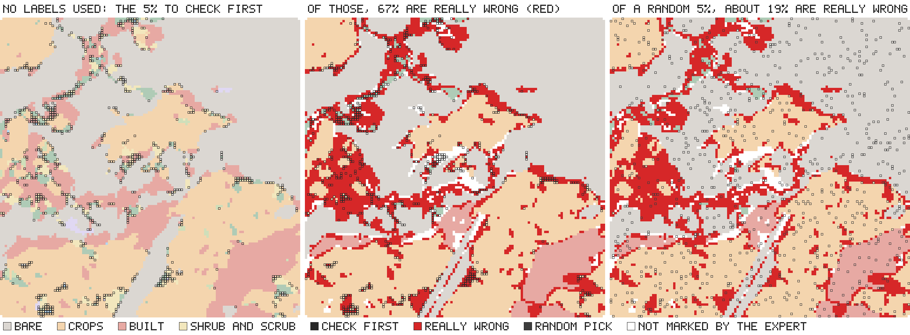

# olmoearth_inferenceX

olmoearth_inferenceX is a Python package for assessing classification maps from Earth-observation models. Without
reference labels, it ranks a map's windows by the model's confidence for manual review, lists the cues behind each
flagged window, and compares two maps of the same area. With a labelled sample, it estimates the error rate and
per-class accuracy with confidence intervals.

The package reads the per-pixel probabilities, logits or class scores that a model exports, as GeoTIFF or `.npy`
arrays, and needs no access to the model itself. It was developed on OlmoEarth and does not require torch.

## Commands

| Command | What it does |
|---|---|
| `demo` | Assesses a real land-cover map shipped with the package and draws the result |
| `assess` | Ranks a map's windows by confidence into review sets, with the cues behind each window |
| `compare` | Measures where two maps of the same area differ and, with labels, which one is right there |
| `sample` | Selects the windows to label |
| `estimate` | Estimates the error rate from the labelled sample, with a 95% interval; with `--per-class`, per-class accuracy |
| `certify` | Certifies, from a random labelled sample, the largest most-confident share of the map whose error rate is at most a stated level |

Each command is described in [Usage](Usage.md#command-line).

## Demo

```bash
pip install olmoearth-inferencex
oe-inferencex demo
```

The demo assesses one Dynamic World tile with expert annotation. The tile was selected by a rule fixed before any
tile was examined, as the lower median by error capture at a 5% budget among the 18 of Dynamic World's 409
expert-annotated test tiles that meet the rule's criteria (annotated on at least 90% of windows, at least three
classes on 5% of the windows each, an error rate between 5% and 35%); the selected tile is therefore typical rather
than the most favourable. <!-- claim:demo-sample-is-the-median-tile -->



*Left: the 5% of windows ranked first, selected without labels. Middle: the same windows over the map's errors, in
red; 67% of them are wrong, against 19% of the map. Right: a random 5%. The flagged windows hold 17% of the errors;
with 19% of the map wrong and 5% reviewed, no selection of that size could hold more than 26%. A 20% review holds
55%.* <!-- claim:demo-sample-hit-rate -->

Another map is assessed with `oe-inferencex assess your_map.tif --out audit`.

## Installation

```bash
pip install olmoearth-inferencex            # the package; no torch
pip install "olmoearth-inferencex[geo]"     # with GeoTIFF input and output
```

The package requires Python 3.11 to 3.13. To work on the repository:

```bash
git clone https://github.com/2imi9/olmoearth_inferenceX.git
cd olmoearth_inferenceX
uv sync
uv run pytest
```

The experiments also require `uv sync --extra encoder --extra geo`
([Usage: reproducing the experiments](Usage.md#reproducing-the-experiments)).

## Documentation

- [Findings](Findings.md#in-short): what holds, what was rejected, and the limits; each statement links to its evidence.
- [Usage](Usage.md): inputs, commands, the Python API and reproducing the experiments.
- [Recipe](method/recipe.md): what to do and not do when assessing a map.
- [Comparisons](results/comparisons.md): the record of each experiment; the [technique ledger](TECHNIQUES.md) lists
  every technique tried with its verdict.
- [Protocol](method/protocol.md): how results are scored; the [claim ledger](method/claims.md); the
  [preregistrations and decisions](plan/index.md).
- [Related work](related_work.md) and the
  [technical report](https://github.com/2imi9/olmoearth_inferenceX/blob/main/report/main.pdf).
- [API reference](reference/index.md): the `oe_inferencex` package, module by module.

## Licence and contact

Apache License 2.0 ([LICENSE](https://github.com/2imi9/olmoearth_inferenceX/blob/main/LICENSE)); citation in
[CITATION.cff](https://github.com/2imi9/olmoearth_inferenceX/blob/main/CITATION.cff). Questions and suggestions as
[GitHub issues](https://github.com/2imi9/olmoearth_inferenceX/issues).
