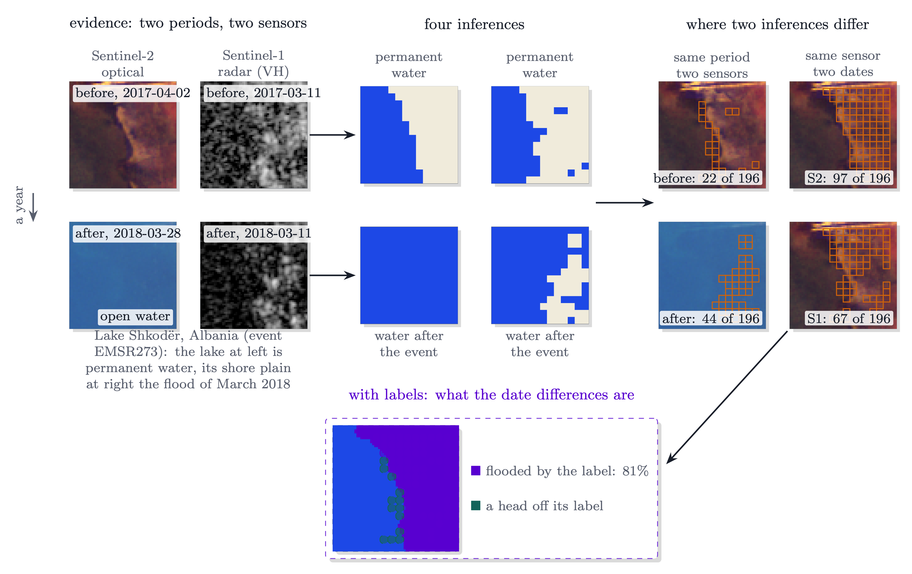

# olmoearth_inferenceX

olmoearth_inferenceX measures differences between OlmoEarth inferences
without labels, and shows on expert-labelled testbeds which of those
differences predict error.

On those testbeds the model's own logit margin is the difference that
predicts error; disagreement across crops, backbones or encoders does not
rank errors; the sensor difference says where the shared errors come from;
the frozen-versus-fine-tuned difference measures how much training moved
the model. Given a prediction map, it helps with:

1. **Deciding which windows to trust and which to send for review first**, as
   review sets at a chosen budget, in confidence order or boundary first.
2. **Explaining why each flagged window is suspect**, with label-free cues that
   carry measured evidence from expert-labelled testbeds.
3. **Scoring any candidate audit rule the same way**, against the model's own
   confidence and a no-model control, on two references at once.
4. **Auditing deployed OlmoEarth products**: the fine-tuned models through their
   task cards, and the served land cover change rasters.
5. **Measuring the difference between two inferences of the same scene**,
   through shifted crops, across backbones, across sensors and before
   against after fine-tuning: how much they disagree, what the disagreement
   windows have in common and, with labels, which side is right.



*The two-period, two-sensor square on one GEOID-Flood chip (event EMSR273-1, the shore of Lake Shkodër
at Gruemirë, Albania): the Sentinel-2 composite and the Sentinel-1 pass before the event, the Sentinel-1 pass after it
and, from WorldFloods v2, the Sentinel-2 scene after it, each read by its head on identical windows. The
same-period pairs differ on 22 windows before the event and 44 after, along the lake shore and where the radar
sees flooded vegetation as bright; the same-sensor pairs differ on 97 windows (optical) and 67 (radar), and
the label says 81% of the radar's date differences are the flood, the rest a head off its label at the
shore. Over exp60's 55 events the same-period pair before the event differs on 4.9% of windows and 0.4%
of those are the later flood; the radar pair across the event differs on 3.4% with 26% flood; on the 544
chips with all four cells (exp62) the radar pair across the event is 41% flood and the same-period pair
after it 18%. What a difference is needs labels, so that panel is boxed apart.*

A worked flood example, runnable from the committed artifacts, is in
[Usage: compare two inferences of the same scene](Usage.md#compare-two-inferences-of-the-same-scene);
the event-level results are in [Comparisons](results/comparisons.md#the-difference-atlas-every-pair-of-inferences-under-one-measurement-exp57).

## New to the repository?

For the short version, read [Findings](Findings.md): what holds, the numbers,
how a claim gets in, and the limits. Then:

- [Usage](Usage.md) walks through the package: assess a prediction, explain its
  review set, the production case with an exported confidence band, and how to
  score a new rule with the same machinery.
- The [Recipe](method/recipe.md) is the list of what to do and not do when
  auditing a prediction map.
- The [Technique ledger](TECHNIQUES.md) is everything tried, one line each,
  with the verdict and the evidence; the [Evidence](results/explanation.md)
  pages hold the per-cue, per-signal and per-experiment detail.
- The [API Reference](reference/index.md) documents the torch-free package
  `oe_inferencex` module by module.

## Installation

The package needs Python 3.11+ (3.12 is what the experiments ran on) and no
torch; the experiments need the encoder.

```bash
git clone https://github.com/2imi9/olmoearth_inferenceX.git
cd olmoearth_inferenceX
uv sync
uv run pytest
```

For the full experiment environment:

```bash
uv sync --extra encoder --extra geo
uv run python scripts/audit_one_scene.py   # one scene end to end
```

## Contact

For questions and suggestions, please
[open an issue on GitHub](https://github.com/2imi9/olmoearth_inferenceX/issues).
