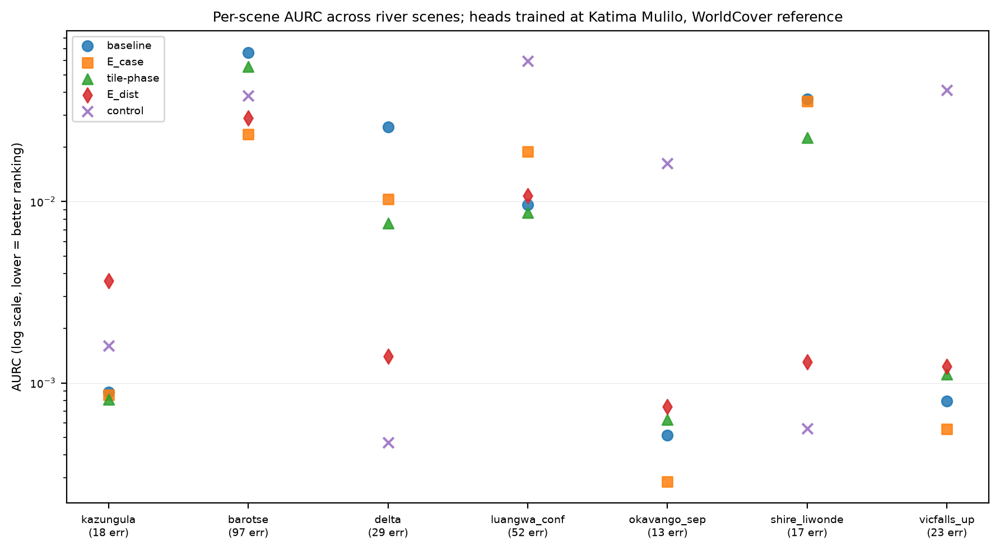
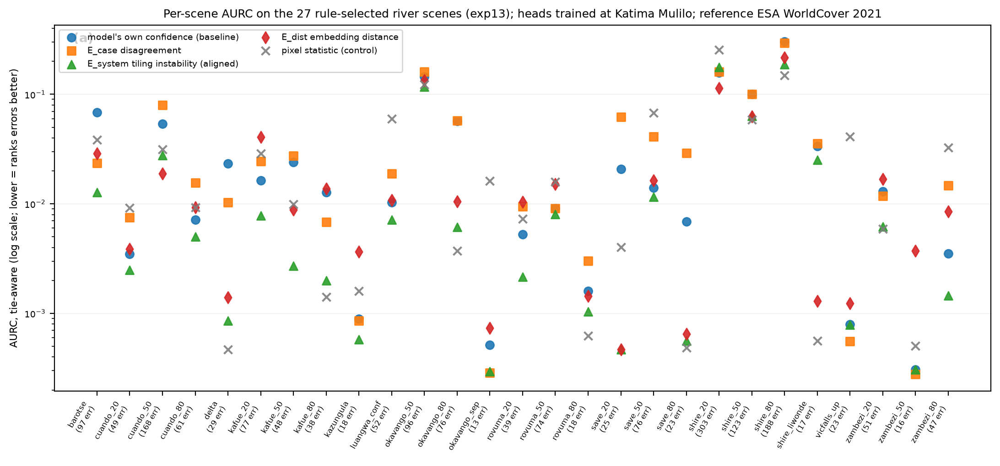

# Cross-signal comparisons

All signals scored on identical errors with the same harness, per
condition. Index at [TECHNIQUES.md](../TECHNIQUES.md); protocol and status
terms in [protocol.md](../method/protocol.md).

### Multi-scene replication (exp09; tile-phase unaligned and statistics superseded by exp13)
- The full signal comparison plus the NDWI-gradient control over seven river
  scenes across southern Africa (Kazungula, Barotse, Zambezi delta, Luangwa
  confluence, Okavango panhandle, Shire at Liwonde, upstream Victoria
  Falls), heads trained at Katima Mulilo, WorldCover reference, 8+ errors
  per scene. Per-scene results in exp/out/exp09_multiscene.csv.
- Max-softmax confidence produced the best ranking on zero of seven scenes
  (mean AURC 0.0201 +/- 0.0230).
- E_case won three scenes (mean 0.0129 +/- 0.0127) and beat the pixel
  control on every scene it won, including a zero-reference-water scene
  (Okavango: 0.0003 vs control 0.0163) whose errors are therefore not
  spectrally trivial. Tile-phase won two (mean 0.0138), both with the
  control far behind.
- The control won exactly the two scenes identified as reference-omission
  regimes (delta, Shire), consistent with exp06.
- E_dist won zero scenes once the control was included; its earlier apparent
  shift-scene advantages were both control-dominated scenes.
- Standing caveats: WorldCover reference, small per-scene error counts, no
  formal significance testing yet.

  

### No-model image-statistic controls (exp06)
- Control signals computed directly from pixel values (within-patch spectral
  variance, patch-mean |NDWI| proximity to the water/land boundary, NDWI
  gradient magnitude), scored on identical errors with the same harness.
- Kazungula: every model signal retains a margin over the best control
  (tile-phase 0.00058, |Nano-Base| 0.00086 vs spectral variance 0.0012).
- Barotse floodplain: E_case retains a margin over the best control (0.0235
  vs NDWI gradient 0.0384). The wetland-margin result therefore does not
  reduce to edge detection.
- Zambezi delta: all three no-model statistics rank the disagreements as
  well as or better than every model signal (NDWI gradient 0.0005 vs E_dist
  0.0014). The delta scene's disagreements are spectrally trivial (the river
  the reference misses), so this scene supports no claim of model-signal
  superiority; the E_dist shift claim is withdrawn pending a shift testbed
  with non-trivial errors.
- Secondary observation: on both difficult scenes, even no-model statistics
  rank errors better than max-softmax confidence.

  

### Validation against expert labels (AWF, exp04)
- Source: the
  [olmoearth_projects_awf dataset](https://huggingface.co/datasets/allenai/olmoearth_projects_awf)
  with classes and split defined by its
  [task config](https://github.com/allenai/olmoearth_projects/blob/main/olmoearth_run_data/awf/model.yaml).
- The full pipeline runs against the AWF partner dataset: 1459 expert-labeled
  points, 12-month Sentinel-2 stacks, the project's own 1115/344 spatial
  split. A linear head on frozen Base embeddings reaches 81.7% validation
  accuracy (the project's fully fine-tuned model: 89.5%), giving 63 errors
  for signal evaluation.
- On this in-domain multiclass task, max-softmax achieved the lowest AURC
  (0.0363) of the signals tested (tile-phase 0.0489, Nano-Base total
  variation 0.0670).
- Lowest per-class recall: herbaceous wetland (0.50, n=6 validation points,
  so indicative only). Class-index-to-name mapping verified against the
  per-class metric definitions in olmoearth_projects awf model.yaml.
- Completing the comparison on the same 63 errors (exp12): E_dist
  knn-to-train 0.1338 and a no-model spectral-variability control 0.1658,
  both far behind the baseline. In-domain AWF errors are neither
  out-of-distribution nor pixel-trivial, consistent with the water-task
  pattern.

  

### Single difficult scenes (exp05; tile-phase values unaligned, superseded by exp13)
- Water heads trained at Katima Mulilo, evaluated on (a) the Barotse
  floodplain interior (ambiguous wetland margins, in-region) and (b) the
  Zambezi delta mangrove coast (~1300 km from the training region). On both
  scenes, every channel tested achieved lower AURC than max-softmax
  (floodplain: E_case 0.0235, E_dist 0.0289, tile-phase 0.0555, baseline
  0.0666; delta: E_dist 0.0014, tile-phase 0.0076, E_case 0.0103, baseline
  0.0258). The delta column was later disqualified as evidence for
  model-signal superiority by the exp06 controls; the Barotse column
  survived.
- Reference-label caveat: ESA WorldCover is least reliable on exactly these
  terrains. The signals rank model-reference disagreement correctly; whether
  that equals model error requires expert-labeled replication.

  

### Corrected statistics on the rule-selected scene set (exp13, authoritative)
- Same errors and heads as exp11, recomputed with: (1) tile-phase aligned
  on a pixel canvas before taking the std across shifts (exp05/09/11
  compared unaligned patch grids); (2) excess AURC (E-AURC = AURC minus the
  oracle's), which makes absolute levels comparable across scenes; it does
  not change any signal-minus-baseline difference or any test on them; (3)
  a 4x4-patch block bootstrap (B=1000) for per-scene intervals; (4) AURC
  computed as its expectation under random tie-breaking, since the boundary
  score has nine levels and float32 sigmoid saturation ties the
  max-softmax uncertainty at zero on a large share of patches, so a
  stable-sort AURC depends on raster order; (5) the baseline scored as the
  negative absolute logit, monotone in max-softmax and tie-free where the
  sigmoid saturates. Two scenes (kafue, luangwa) that entered exp11 through
  a cache import rather than the pre-registered rule are excluded; 27
  scenes remain. Per-scene values in exp/out/exp13_corrected_stats.csv.
- Aligned tile-phase beats the baseline on 26/27 scenes (1 worse, 0 tied;
  exact sign test on untied pairs p=4e-07; sign-flip permutation on
  mean E-AURC differences p=0.000); its percentile block-bootstrap
  interval excludes zero in its favor on 18 scenes and against on
  0. It beats the pixel control on 18/27, E_case on
  23/27, E_dist on 22/27, and is the best of the five
  signals on 12/27 (best or second on 24/27). Per-scene
  percentile intervals are biased for this rank statistic on high-error
  scenes and are indicative only; the cross-scene sign and permutation
  tests do not use them.
  

- The unaligned tile-phase of exp11 scores 17/27
  (sign p=0.25): the misalignment hid the effect. Erratum.
- E_case: 10/27 (sign p=0.25); intervals in its favor on
  3 scenes and against on 9. Not a general signal.
- E_dist: 13/27 (sign p=1.00); mean-difference sign-flip
  permutation p=0.01, unchanged from exp11 because the oracle
  subtraction cancels in within-scene differences. The mean-based test is
  carried by the high-error scenes; the scale-free sign test is reported as
  primary and shows no advantage. Intervals: 11 in favor, 5 against.
- Control: 14/27 vs baseline; best signal on 9/27, the
  reference-omission scenes. Baseline best on 0/27.
- Head-seed variance is structurally zero (deterministic head training), as
  noted under exp11.

### Boundary ablation of tile-phase (exp14)
- Question: is aligned tile-phase a perturbation signal or a detector of
  boundaries in the model's own prediction map? Two zero-cost proxies from
  the shift-0 map alone: gradient magnitude of the probability map, and the
  fraction of a patch's 8 neighbors whose hard label differs. Scored with
  tie-aware E-AURC on the 27 rule-selected scenes, alongside the pixel
  control.
- The discrete boundary fraction is statistically indistinguishable from
  tile-phase across scenes: boundary better on 12, tile-phase on 15,
  tied on 0 (sign p=0.70, median E-AURC difference -0.00012); per-scene
  values differ in both directions, so this is a null result, not an
  equivalence. The boundary fraction alone beats the baseline on 19/27
  (p=0.052) and the pixel control on 22/27 (p=0.002); the
  continuous gradient is weaker (tile-phase better on 25/27).
  Best-signal tally among the five: {'pred-boundary': 10, 'tile-phase (aligned)': 10, 'control': 5, 'baseline': 2}.
- Conclusion: no advantage of the perturbation beyond boundary proximity is
  detectable. The supported claim is that errors concentrate at prediction
  boundaries and the aligned tile-phase signal ranks them better than
  confidence; the zero-cost boundary indicator is indistinguishable from
  tile-phase across scenes, but its own margin over confidence is marginal
  (p=0.05), so the zero-inference shortcut is suggestive, not established. The exp04 loss was examined in exp16: labelled patches are not
  interior, the score is error-associated, but it is largely a proxy for
  low margin on the nine-class task, so confidence wins there. Values in exp/out/exp14_boundary_ablation.csv.

### Boundary proximity combined with the reference-map check (exp15)
- E_geo flag = patch on an OSM waterway=river centerline that the model
  predicts dry. Georeferencing recovered for 27 of the 27 rule-selected
  scenes (Overpass failures excluded). Signals: boundary (exp14), geo flag
  alone, geo-first-then-boundary.
- Prepending the flag changes the ranking only on scenes carrying flags:
  better on 5, worse on 9, unchanged on 13 of 27 (exact sign test on
  untied pairs p=0.42). No benefit shown; not significantly worse. Geo
  alone beats the baseline on 3/27; boundary alone on 19/27.
- E_geo sensitivity: 17/27 scenes carry flags; pooled precision
  0.12 over 413 flags against a base error rate of 0.081
  (1.5x), while the unweighted per-scene mean of 0.22 is inflated by
  scenes with one or two flags. 9 scenes carry 1-51 flags at precision
  exactly zero: OSM marks a river that both the model and WorldCover call
  dry, i.e. disagreement between two reference maps on narrow or seasonal
  channels. Under WorldCover truth, E_geo precision cannot be separated
  from the reference confound. Values in exp/out/exp15_boundary_geo.csv.
- Implication: E_geo needs width-filtered centerlines (GRWL width
  attribute) or expert truth before its sensitivity can be stated.

### Boundary signal on the AWF point-label task (exp16)
- The explanation offered for exp04, "point labels carry no boundary
  context", was tested directly. The Base head was applied densely to all
  64 patches of each validation crop and the exp14 boundary indicator was
  computed at the labelled patch; errors reproduce exp04 exactly
  (63/344). The script was adversarially reviewed before recording
  (exp/out/review_exp16_wf_5d95d304.json); the review's corrections are
  built in: the score is derived from the head's own prediction map, not
  ground-truth boundaries, so both questions below are tested against the
  right reference, and uncertainty uses a cluster bootstrap over the
  30 annotation tasks.
- Ranking: the negative logit margin (confidence) ranks errors better than
  the boundary score (tie-aware AURC 0.0363 vs 0.0636; cluster-bootstrap
  95% interval on the difference [+0.0023, +0.0562], P(boundary better)
  = 0.016) and than per-window tile-phase (0.0489; interval
  [+0.0023, +0.0221]).
- Are labelled patches interior? No. The labelled patch's score is zero on
  47% of windows against 43% for the other patches of the same
  maps; its within-window quantile averages 0.46, and paired against a
  random non-label patch it is higher on 89 windows and lower on
  129 (sign p=0.008). Labelled patches are, if anything, slightly
  less boundary-like than an arbitrary patch.
- Does the score carry error information? Marginally, strongly: 90% of
  errors have a nonzero score against 44% of correct windows (Fisher
  p=2e-12; Mann-Whitney z=8.9); error rate rises from
  4% at score 0 to about 64% at score 1.
  Conditionally, little: the score correlates with the margin (Spearman
  0.60), and in a logistic model of error on both, the margin dominates
  (standardized coefficients 3.53 vs 0.52; likelihood-ratio test for
  adding the score chi2=9.5, p=0.002). The margin re-quantized to the
  score's own tie-group sizes still scores 0.0367, so the loss is
  not a granularity effect.
- Reading: on a nine-class task the argmax flips between neighbouring
  patches wherever margins are small, so the prediction-boundary score is
  largely a coarse proxy for low confidence; the margin already carries
  that information at finer resolution. The "no boundary context"
  explanation is withdrawn; the in-domain result (confidence best on AWF)
  stands with this explanation. Caveat: the AWF split is by point, not by
  task, so every validation task also contributes training windows. Values
  in exp/out/exp16_awf_boundary.csv and exp16_summary.json.

### Pre-registered scene set (exp11; statistics superseded by exp13)
- The scene rule and scene set below stand. The statistics in this section
  use raw AURC and the unaligned tile-phase; exp13 corrects both and is
  authoritative where they differ.
- Scene rule committed to git before any new scene was fetched: candidates
  sampled at fixed fractions along OSM geometries of eight named rivers,
  0.2-degree separation, inclusion iff the deterministic Base head commits
  >=8 errors against WorldCover. 20 rule-selected scenes joined the 7 exp09 scenes plus 2 unsuffixed exp09
  first-attempt AOIs (kafue, luangwa) that entered through the cache import
  and are excluded from exp13 onward; 29 total here, 27 in exp13-exp15. Per-scene AURC, bootstrap 95% CIs (B=1000), and
  seed columns in exp/out/exp11_stats.csv.
- Baseline best on 6/29 scenes: the exp09 claim "confidence never best
  (0/7)" did not survive scene expansion and is superseded.
- Sign-flip permutation tests on per-scene AURC differences vs baseline:
  E_case better on 12/29, mean difference -0.0058 (trend toward worse,
  p=0.070); tile-phase better on 19/29 but mean difference -0.0002
  (p=0.950); E_dist better on 13/29 with mean difference +0.0098
  (p=0.019), the only significant mean improvement, driven by high-error
  floodplain scenes (Shire, Okavango mid-stem: 8-30% error rates) where
  WorldCover reliability is lowest; control not significant (p=0.848).
- Coherent summary: no signal dominates across scenes. Which signal ranks
  errors best is regime-dependent, which elevates regime identification
  (deciding per scene which signal to trust) from a side idea to the central
  open problem.
- Head-seed variance is structurally zero: heads initialize at zeros with
  deterministic full-batch training, so the planned seed-robustness test is
  vacuous rather than passed; robustness to head initialization remains
  untested by design choice.
- Standing caveats unchanged: WorldCover reference (worst on exactly the
  high-error scenes that drive the E_dist result), no expert labels outside
  AWF, one task family.
